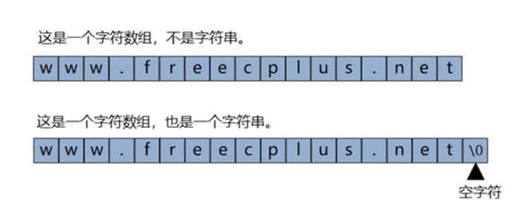

# Sting字符串



在 C 语言中，字符用单引号表示，字符串用双引号表示。

我们可以把字符串储存在char类型的数组中，如果char类型的数组末尾包含一个表示字符串末尾的空字符\0，则该数组中的内容就构成了一个字符串。

在 C 语言中，我们可以通过下面这两种方式来定义字符串类型的变量，一种是指针形式，另一种是数组形式

```c
// read-only string.
const char strA[] = "Hello, geek!";
const char* strB = "Hello" ", geek!"; //C 标准中规定，连续出现的字符串字面量之间如果仅由空格分隔，则会将它们视为一个整体。
```

使用数组和指针形式定义的字符串，其底层的数据引用方式会有所区别。

- 其中数组方式会将字符串数据从 .rodata 中拷贝到其他位置（比如栈内存），因此修改这些数据不会改变存在于原始 .rodata 中的副本。
- 而使用常量指针形式定义的数组，该指针会直接引用位于 .rodata 中的字符串数据。

## 占用内存的情况

一个字符占用一字节的内存，字符串定义时数组的大小就是字符串占用内存的大小。

```c
char str[21];     // 占用21字节的内存
char str[1024];   // 占用1024字节的内存
```

## 字符串的初始化

1. 方式一

```c
char strname[21];
strname[0]=0;    // 把第一个元素的值置为0
```

2. 方式二

```c
char strname[21];
memset(strname,0,sizeof(strname));  // 把全部的元素置为0
```

strname[0]=0;不够规范，并且存有隐患，在实际开发中，一般采用memset的函数初始化字符串。

## 字符串与指针

在C语言中，数组名是数组元素的首地址，字符串是字符数组，所以在获取字符串的地址的时候，不需要用&取地址。

```c
char strname[21];
memset(strname,0,sizeof(strname));
strcpy(strname,"abcdefghijk");     // 把abcdefghijk赋值给strname
printf("%s\n",strname);              // 输出abcdefghijk
```

## 字符串越界

字符串是字符数组，字符串越界就是数组越界。字符串的越界是初学者经常犯的错误之一。

```c
#include <stdio.h>
#include <string.h>
 
int main()
{
  char strname1[21];
  memset(strname1,0,sizeof(strname1));
  char strname2[21];
  memset(strname2,0,sizeof(strname2));
  strcpy(strname1,"真的只能存十个汉字吗，多几个行不行？");
  strcpy(strname2,"是的，只能十个，多了不行。");
  printf("=%s=\n",strname1);
  printf("=%s=\n",strname2);
 
  char strname[2][21];
  memset(strname,0,sizeof(strname));
  strcpy(strname[1],"是的，只能十个，多了不行。");
  strcpy(strname[0],"真的只能存十个汉字吗，多几个行不行？");
  printf("=%s=\n",strname[0]);
  printf("=%s=\n",strname[1]);
}
```

前8行代码定义了两个字符串变量，每个能存放20个字符或10个中文，但实际赋值都超过了10个中文，从输出结果看，没有问题。

后6行代码采用了二维数组的方式定义了字符串变量，理论上说，与分开定义的两个字符串变量没有区别，但是，从输出结果看，很有问题。

真正的原因是这样的，在C语言中，数组越界肯定是非法的，但非法操作并不一定会出问题，前8行代码的字符串是越界了，但是strname1和strname2变量的内存之后的内存空间是未分配的，所以对strname1和strname2赋值过长也没关系。后6行代码就不一样了，二维数组的两个变量之间的内存是连续的，第一个元素之后没有多余的空间，所以第一个元素的值就出问题了。

总的来说，在C语言中，非法操作内存不一定会报错，要看运气。

在现实生活中，一个农民把庄稼种到了自家的地盘之外，如果您的地盘之外的地没有主人，是不会有问题的，但如果有主人，这事就肯定会引起纠纷，系统对这种纠纷的裁决是内存越界的程序非法，强制终止它（段错误）。

## 字符串常用的库函数

1. 获取字符串的长度（strlen）

```c
size_t  strlen( const char*  str);
```

功能：计算字符串的有效长度，不包含0。

返回值：返回字符串的字符数 。

strlen 函数计算的是字符串的实际长度，遇到第一个0结束。

函数返回值一定是size_t，是无符号的整数，即typedef unsigned int size_t。

如果您只定义字符串没有初始化，求它的长度是没意义的，它会从首地址一直找下去，遇到0停止。

2. 字符串复制或赋值

```c
char *strcpy(char* dest, const char* src);
```

功 能: 将参数src字符串拷贝至参数dest所指的地址。

返回值: 返回参数dest的字符串起始地址。

复制完字符串后，在dest后追加0。

如果参数dest所指的内存空间不够大，可能会造成缓冲溢出的错误情况。

```c
char * strncpy(char* dest,const char* src, const size_t n);
```

功能：把src前n字符的内容复制到dest中

返回值：dest字符串起始地址。

如果src字符串长度小于n，则拷贝完字符串后，在dest后追加0，直到n个。

如果src的长度大于等于n，就截取src的前n个字符，不会在dest后追加0。

dest必须有足够的空间放置n个字符，否则可能会造成缓冲溢出的错误情况。

3. 字符串拼接（strcat）

```c
char *strcat(char* dest,const char* src);
```

功能：将src字符串拼接到dest所指的字符串尾部。

返回值：返回dest字符串起始地址。

dest最后原有的结尾字符0会被覆盖掉，并在连接后的字符串的尾部再增加一个0。

dest要有足够的空间来容纳要拼接的字符串，否则可能会造成缓冲溢出的错误情况。

Note: 字符串的strcpy和strcat函数要求dest参数有足够的空间，否则会造成内存的泄漏，所以在实际开发中，定义字符串的时候，可以大一些，
例如姓名，中国人的姓名以两三个汉字为主，最多五个，少数民族可能十几个，外国人的很长，喜欢在自己的名字前加上爷爷的名字和外公的名字，
那么我们在定义变量的时候，可以char name[301];存放他祖宗十八代的名字也没有问题。

内存不值钱，程序的稳定性高于一切。

```c
char *strncat (char* dest,const char* src, const size_t n);
```

功能：将src字符串的前n个字符拼接到dest所指的字符串尾部。

返回值：返回dest字符串的起始地址。

如果n大于等于字符串src的长度，那么将src全部追加到dest的尾部，如果n小于字符串src的长度，只追加src的前n个字符。

strncat会将dest字符串最后的0覆盖掉，字符追加完成后，再追加0。

dest要有足够的空间来容纳要拼接的字符串，否则可能会造成缓冲溢出的错误情况。

4. 字符串比较（strcmp、strncmp）

```c
int strcmp(const char *str1, const char *str2 );
```

功能：比较str1和str2的大小。

返回值：相等返回0，str1大于str2返回1，str1小于str2返回-1；

```c
int strncmp(const char *str1,const char *str2 ,const size_t n);
```

功能：比较str1和str2前n个字符的大小。

返回值：相等返回0，str1大于str2返回1，str1小于str2返回-1；

两个字符串比较的方法是比较字符的ASCII码的大小，从两个字符串的第一个字符开始，如果分不出大小，就比较第二个字符，如果全部的字符都分不出大小，就返回0，表示两个字符串相等。

在实际开发中，程序员一般只关心字符串是否相等，不关心哪个字符串更大或更小。

5. 字符查找（strchr、strrchr）

```c
char *strchr(const char *s,const int c);
```

返回一个指向在字符串s中第一个出现c的位置，如果找不到，返回0。

```c
char *strrchr(const char *s,const int c);
```

返回一个指向在字符串s中最后一个出现c的位置，如果找不到，返回0。

7. 字符串查找（strstr）

```c
char *strstr(const char* str,const char* substr);

```

功能：检索子串在字符串中首次出现的位置。

返回值：返回字符串str中第一次出现子串substr的地址；如果没有检索到子串，则返回0