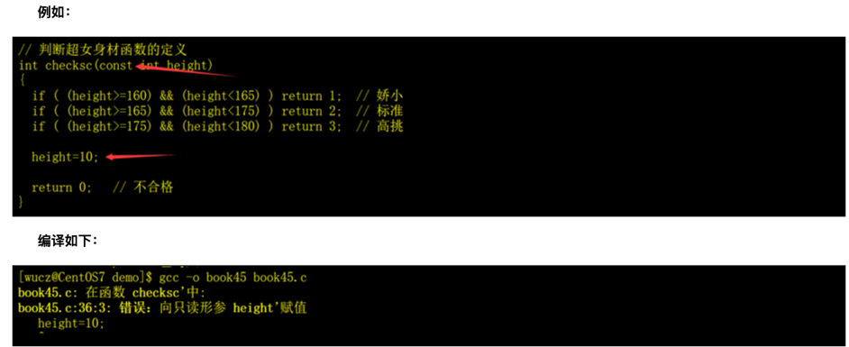

<!-- START doctoc generated TOC please keep comment here to allow auto update -->
<!-- DON'T EDIT THIS SECTION, INSTEAD RE-RUN doctoc TO UPDATE -->
**Table of Contents**  *generated with [DocToc](https://github.com/thlorenz/doctoc)*

- [Func函数](#func%E5%87%BD%E6%95%B0)
  - [自定义函数的声明](#%E8%87%AA%E5%AE%9A%E4%B9%89%E5%87%BD%E6%95%B0%E7%9A%84%E5%A3%B0%E6%98%8E)
  - [自定义函数的定义](#%E8%87%AA%E5%AE%9A%E4%B9%89%E5%87%BD%E6%95%B0%E7%9A%84%E5%AE%9A%E4%B9%89)
  - [自定义函数代码的组织](#%E8%87%AA%E5%AE%9A%E4%B9%89%E5%87%BD%E6%95%B0%E4%BB%A3%E7%A0%81%E7%9A%84%E7%BB%84%E7%BB%87)
  - [库函数](#%E5%BA%93%E5%87%BD%E6%95%B0)
  - [调用函数的方法](#%E8%B0%83%E7%94%A8%E5%87%BD%E6%95%B0%E7%9A%84%E6%96%B9%E6%B3%95)
  - [const约束](#const%E7%BA%A6%E6%9D%9F)

<!-- END doctoc generated TOC please keep comment here to allow auto update -->

# Func函数

## 自定义函数的声明
C语言中的声明函数的语法如下：
```c
return_type function_name( parameter list );
```
1）返回值的数据类型return_type：函数执行完任务后的返回值，可以是int、char、double或其它自定义的数据类型。如果函数只执行任务而不返回值，return_type用关键字 void表示，如下：
```c
void function_name( parameter list );
```
2）函数名function_name：函数名是标识符，命名规则与变量相同。

3）参数列表parameter list：当函数被调用时，调用者需要向函数传递参数。参数列表包括参数的数据类型和书写顺序。参数列表是可选的，也就是说，函数可以没有参数，如下：
```c
return_type function_name();
```

函数声明示例：
```c
// 判断超女身材函数的声明
// 函数名：checksc
// 参数：height，身高，单位cm。
// 返回值：0-不合格；1-娇小；2-标准；3-高挑
int checksc(int height);
```

## 自定义函数的定义
C语言中的函数定义的语法如下
```c
return_type function_name( parameter list )       // 注意，不要在函数定义的最后加分号。
{
// 实现函数功能的代码
}
```

函数主体包含为了完成任务需要执行语句的集合，放在花括号内。
```c
// 判断超女身材函数的定义
int checksc(int height)
{
    if ( (height>=160) && (height<165) ) return 1;  // 娇小
    if ( (height>=165) && (height<175) ) return 2;  // 标准
    if ( (height>=175) && (height<180) ) return 3;  // 高挑
    
    return 0;   // 不合格
}
```

## 自定义函数代码的组织


1. 非通用功能的函数

如果自定义函数只在调用者程序中使用，可以在调用者程序中声明和定义，声明一般为调用者程序的上部，定义一般在调用者程序的下部，这并不是C语言的规定，而是为了让程序更方便阅读，程序员约定的写法。
```c
#include <stdio.h>
#include <string.h>
 
// 判断超女身材函数的声明
// 函数名：checksc
// 参数：height，身高，单位cm。
// 返回值：0-不合格；1-娇小；2-标准；3-高挑
int checksc(int height);
 
int main()
{
  int ii,jj;
 
  printf("请输入超女的身高（单位：厘米）：");
  scanf("%d",&ii);
 
  jj=checksc(ii);   // 调用checksc函数判断身材
 
  if (jj==0) printf("不合格。\n");
  if (jj==1) printf("娇小。\n");
  if (jj==2) printf("标准。\n");
  if (jj==3) printf("高挑。\n");
}
 
// 判断超女身材函数的定义
int checksc(int height)
{
  if ( (height>=160) && (height<165) ) return 1;  // 娇小
  if ( (height>=165) && (height<175) ) return 2;  // 标准
  if ( (height>=175) && (height<180) ) return 3;  // 高挑
 
  return 0;   // 不合格
}
```

2. 通用功能的函数

如果自定义函数是一个通用的功能模块，可以在公共的头文件中声明，在公共的程序文件中定义。

如果某程序需要调用公共的函数，在调用者程序中用#include指令包含公共的头文件，编译的时候把调用者程序和公共的程序文件一起编译。


## 库函数
C语言提供了很多标准函数（C standard library），简称库函数，调用这些函数可以完成一些基本的功能，例如printf、scanf、memset、strcpy等。

C语言的库函数有几百个，常用的不超过30%

C语言标准库函数的声明的头文件存放在/usr/include目录中，如下：
```shell
<asset.h>  <ctype.h>  <errno.h>  <float.h>  <limits.h>
<locale.h>  <math.h>  <setjmp.h>  <signal.h>  <stdarg.h>
<stddef.h>  <stdlib.h>  <stdio.h>  <string.h>  <time.h>
```

C语言库函数的定义的文件是/usr/lib/gcc/x86_64-redhat-linux/4.4.4/libgcc.a（不同编译器的版本目录名有所不同），这是一个打包好的库文件，把程序文件打包成库文件的方法以后再详细介绍。

我们用gcc编译程序的时候并没有把libgcc.a包含进来，那是因为gcc编译器缺省会包含它，但是，程序员自定义函数的程序文件就没有这种待遇，需要手工的包含进来与程序一起编


## 调用函数的方法
库函数是系统提供的工具，自定义函数是程序员自己补充的工具，对使用者来说都一样，没有区别。

在C语言中，函数的调用非常灵活，可以独占一行语句，也可以当成常量赋值给变量，也可以当成函数的参数。

如果函数的返回值是void，表示该函数的调用一定会成功，一般用单行书写，独占一条语句。

如果函数的返回值不是void，可以不关心它的返回值，也可以当成常量用于任何表达式中。


## const约束
const 是 constant 的缩写，意思是“恒定不变的”，它是定义只读变量的关键字。用 const 定义只读变量的方法很简单，就在定义变量时前面加 const 即可，如
```c
const  double  pi = 3.1415926;
```
用 const 定义的变量的值是不允许改变的，不允许给它重新赋值，即使是赋相同的值也不可以。所以说它定义的是只读变量。这也就意味着必须在定义的时候就给它赋初值，如果程序中试图改变它的值，编译的时候就会报错。

在变量前加const约束，主要用于定义函数的参数，表示该参数在函数中是只读取，不允许改变，如果函数中试图改变它的值，编译的时候就会报错


为什么要在函数的参数前加const？有两个目的：

1. 防止程序员犯错，如果程序员犯了错误，编译器就能发现；
2.增加了源代码的可读性。在实际开发中，函数的参数不加const不会有任何问题，但是，程序员一般都会为只读变量加上const约束，这是一个好的习惯。