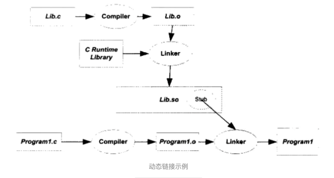

<!-- START doctoc generated TOC please keep comment here to allow auto update -->
<!-- DON'T EDIT THIS SECTION, INSTEAD RE-RUN doctoc TO UPDATE -->
**Table of Contents**  *generated with [DocToc](https://github.com/thlorenz/doctoc)*

- [库](#%E5%BA%93)
  - [静态库](#%E9%9D%99%E6%80%81%E5%BA%93)
    - [具体操作](#%E5%85%B7%E4%BD%93%E6%93%8D%E4%BD%9C)
  - [动态库](#%E5%8A%A8%E6%80%81%E5%BA%93)
    - [配置动态库的方法](#%E9%85%8D%E7%BD%AE%E5%8A%A8%E6%80%81%E5%BA%93%E7%9A%84%E6%96%B9%E6%B3%95)
  - [扩展 经典编译脚本](#%E6%89%A9%E5%B1%95-%E7%BB%8F%E5%85%B8%E7%BC%96%E8%AF%91%E8%84%9A%E6%9C%AC)

<!-- END doctoc generated TOC please keep comment here to allow auto update -->

# 库
库是一种可执行代码的二进制形式，可以直接被操作系统载入内存执行。

通常我们会将一些常用的函数封装成一个库，提供接口给其它程序文件调用。
这样一来，省去了重复写该函数接口。当我们使用该函数时，就可以直接将我们所需要的文件链接到我们的程序中，提高了开发效率。

应用场景：有时想将某代码提供给别人用，但是又不想公开源代码，这时可以将代码封装成库文件。在开发中调用其他人员编写的库。

一般一种语言开发都会附带一个语言库，这些库通常是对系统调用的包装，例如linux下glibc库。通常这些语言库都包含两个版本：静态库和动态库

根据链接方式的不同，链接过程可以分为静态库和动态库


案例：将 add.c 封装成静态库和动态库来使用。

## 静态库
静态库实际上是一组目标文件的集合，linux下可以利用ar命令将多个目标文件打成一个静态库也可以查看一个静态库中包含哪些目标文件。
编译时使用静态库链接方式，链接器只会将静态库中使用到的目标文件链接到最终的输出文件中。

1. 文件命名方式：“libxxx.a”，库名前加“lib”，后缀为".a"。xxx为静态库名。所以查找库名的时候需要注意。

2. 链接时机：静态库的代码是在编译过程中被载入程序中的。这就说明，只要程序编译完成，就不受静态库的影响，比如，把静态库文件移至其它路径等。

3. 链接方式：是将整个函数库的所有数据都加载进了目标。这样的好处是编译后的执行程序不再需要外部的函数库支持。不足之处是：如果静态库更新或者发生改变，则程序必须需要重新编译一次。

### 具体操作
首先将 add.c 编译成目标文件:
```shell script
gcc -c add.c -o add.o
```

然后根据目标文件生成静态库:
```shell script
ar -cr libadd.a add.o
```
ar命令可以用来创建、修改库，也可以从库中提出单个模块

* -c 选项表示 创建一个库。不管库是否存在，都将创建
* -r 选项表示 将模块插入库，如果库中有对应的模块，那么进行更新

如果把多个 .o 文件插入库 .a 里,只需要在后面用空格分开写出来，格式：
```shell script
ar -cr 静态库libname.a  name1.o name2.o
```

生成静态库 libadd.a 后，编译 main.c 连接静态库生成可执行文件main:

```shell script
gcc main.c -o main -I./ -L./ -ladd

./main
```
* -I选项表示头文件路径
* -L表示静态库或者动态库的路径


## 动态库


1. 动态库的命名方式：“lib”，后缀变为“.so”。所以为“libxxx.so” ；
2. 链接时间：动态库在编译的时候并没有被编译进目标代码，而是当你的程序执行到相关函数时才调用该函数库里的相应函数。这样做缺点是因为函数库并没有整合进程序，所以程序的运行环境必须提供相应的库。优点是动态库的改变并不影响你的程序，所以动态函数库升级比较方便。


动态库需要使用 -shared 选项以及 -fPIC 选项
```shell script
gcc -c -fPIC add.c -o a.o
```
-fPIC表示代码是和地址无关的，不需要被不同模块装载重定位load time relocation,其中地址无关的代码技术PIC，position independent code

然后根据目标文件生成动态库.so文件(动态共享对象dynamic shared objects)
```shell script
gcc -shared -o libadd.so a.o
```
* -shared 选项表示生成的是.so动态库文件

上面的步骤可以直接写成:
```shell script
gcc -shared -fPIC main.c -o libadd.so
```

链接动态库:
```shell script
gcc main.c -o main -I./ -L./ -ladd
```

### 配置动态库的方法
1. 将动态库路径配置到LD_LIBRARY_PATH,只是暂时生效。
```shell script
export LD_LIBRARY_PATH="./:$LD_LIBRARY_PATH"
./main
```

## 扩展 经典编译脚本
```shell script
gcc read.c -o read.exe -g -Wall "common/common.c" "common/ss_help.c" "lib/base64/base64.c" "lib/cJSON/cJSON.c" \
-I"../include" -I"./common" -I"./lib" -I"./lib/base64" -I"./lib/cJSON"  \
-lslm_runtime -lslm_control -lss_user_login  -lm -ldl -lpthread \
-L"./" -L"./../lib64" \
-Wl,-rpath="./" -Wl,-rpath="./../lib64"
```
解释
```shell script
gcc     编译工具
read.c  主函数文件
-o read.exe     编译成read.exe二进制
-g              可以使用gdb调试
-Wall           生成所有警告信息
"common/common.c" "common/ss_help.c" "lib/base64/base64.c" "lib/cJSON/cJSON.c"  一起编译的其他C源文件
-I"../include" -I"./common" -I"./lib" -I"./lib/base64" -I"./lib/cJSON"          依赖的头文件所在目录
-lslm_runtime -lslm_control -lss_user_login  -lm -ldl -lpthread                 链接的动态库 libslm_runtime等，可用ldd read.exe查看
-L"./" -L"./../lib64"   放在/lib和/usr/lib和/usr/local/lib里的库直接用-l参数就能链接，否则要加上库文件所在的目录名
-Wl,-rpath=./           编译时指定的 -L  的目录，只是在程序链接成可执行文件时使用的。程序执行时动态链接库加载不到动态链接库，所以要加上。或者加上环境变量也可以：export LD_LIBRARY_PATH
```
