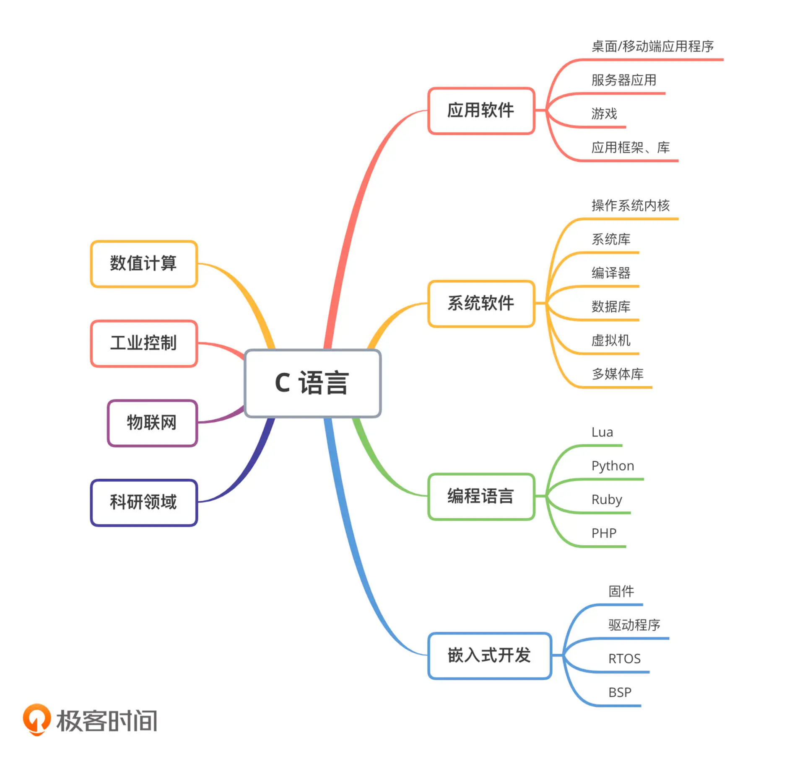
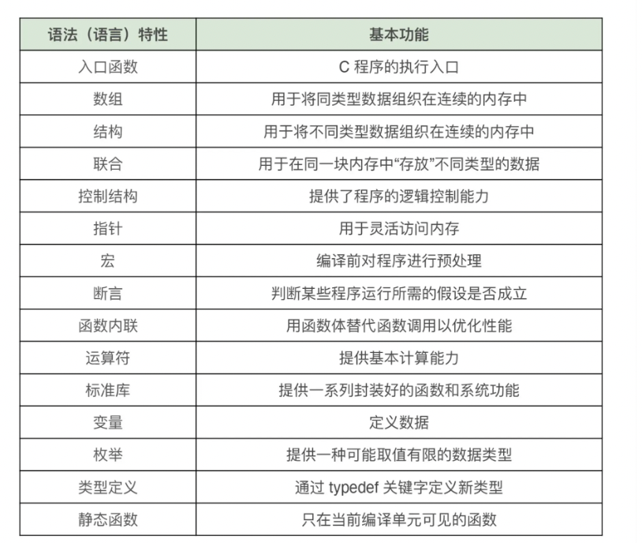

<!-- START doctoc generated TOC please keep comment here to allow auto update -->
<!-- DON'T EDIT THIS SECTION, INSTEAD RE-RUN doctoc TO UPDATE -->
**Table of Contents**  *generated with [DocToc](https://github.com/thlorenz/doctoc)*

- [C 语言](#c-%E8%AF%AD%E8%A8%80)
  - [应用](#%E5%BA%94%E7%94%A8)
  - [学习原因](#%E5%AD%A6%E4%B9%A0%E5%8E%9F%E5%9B%A0)
  - [语法](#%E8%AF%AD%E6%B3%95)

<!-- END doctoc generated TOC please keep comment here to allow auto update -->

# C 语言

## 应用

C 语言被广泛应用于实现操作系统、嵌入式系统应用、编译器、数据库、驱动程序，以及服务器应用等较为底层和基础的系统级程序。
除此之外，C 语言在诸如数值计算、工业控制、物联网，乃至科研领域也有着重要的应用。

## 学习原因

1. C 语言作为一门简单通用的早期编程语言，是 Go、Objective-C、C#、Java 这些高级编程语言在设计时所参考的“原型”语言。可以说，C
   语言就是众多编程语言中的“九阳神功”，相信在你深入了解 C 语言后，再去学习其他语言，也会变得轻松许多。
2. C 语言是目前众多流行操作系统、编译器、上层实用软件与各类系统组件，乃至嵌入式开发所使用的源语言。因此，学习 C
   语言也让我们具有了能够去探索优秀软件内部实现细节的能力，而这通常也是优秀工程师提升自我实力的一种快捷方式。
3. C 语言的抽象程度非常低，是最适合用来帮助理解计算机系统底层运作机制的语言。在学习如何高效使用 C
   语言的过程中，你将会学习到有关高速缓存、内存、寄存器，以及函数调用等相关的内容，而这无疑对你提升自身实力有着巨大的帮助。

## 语法

