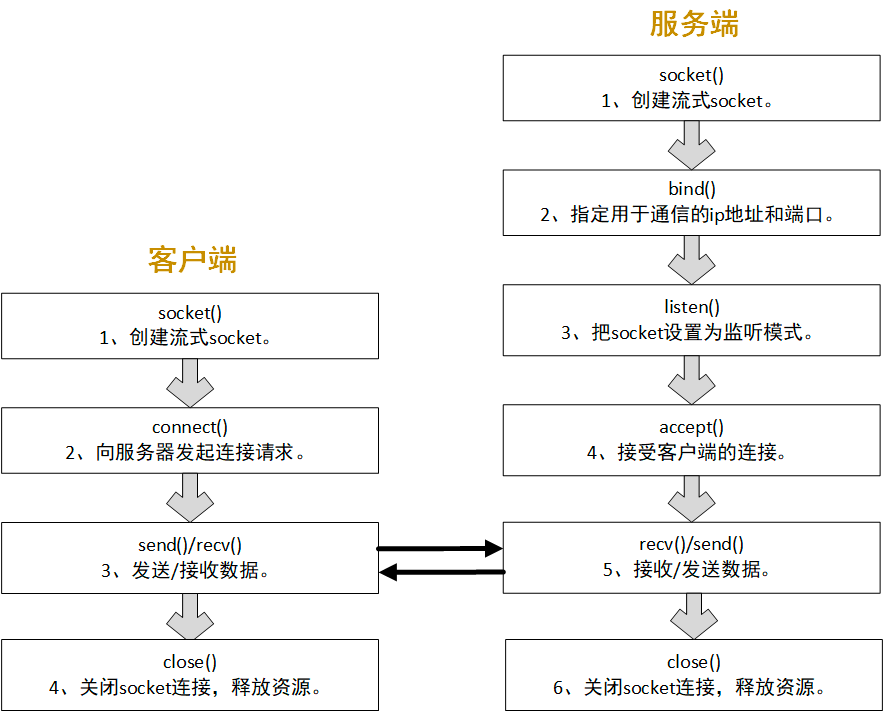

# Socket 

socket就是插座（中文翻译成套接字有点莫名其妙），运行在计算机中的两个程序通过socket建立起一个通道，数据在通道中传输。

socket把复杂的TCP/IP协议族隐藏了起来，对程序员来说，只要用好socket相关的函数，就可以完成网络通信。

## socket的分类
socket提供了流（stream）和数据报（datagram）两种通信机制，即流socket和数据报socket。

流socket基于TCP协议，是一个有序、可靠、双向字节流的通道，传输数据不会丢失、不会重复、顺序也不会错乱。就像两个人在打电话，接通后就在线了，您一句我一句的聊天。

数据报socket基于UDP协议，不需要建立和维持连接，可能会丢失或错乱。UDP不是一个可靠的协议，对数据的长度有限制，但是它的速度比较高。就像短信功能，一个人向另一个人发短信，对方不一定能收到。

在实际开发中，数据报socket的应用场景极少


## 客户/服务端模式
在TCP/IP网络应用中，两个程序之间通信模式是客户/服务端模式（client/server），客户/服务端也叫作客户/服务器，各人习惯。


### send函数
send函数用于把数据通过socket发送给对端。不论是客户端还是服务端，应用程序都用send函数来向TCP连接的另一端发送数据。
```c++
ssize_t send(int sockfd, const void *buf, size_t len, int flags);
```
sockfd为已建立好连接的socket。

buf为需要发送的数据的内存地址，可以是C语言基本数据类型变量的地址，也可以数组、结构体、字符串，内存中有什么就发送什么。

len需要发送的数据的长度，为buf中有效数据的长度。

flags填0, 其他数值意义不大。

函数返回已发送的字符数。出错时返回-1，错误信息errno被标记。

注意，就算是网络断开，或socket已被对端关闭，send函数不会立即报错，要过几秒才会报错。

如果send函数返回的错误（<=0），表示通信链路已不可用。


### recv函数
recv函数用于接收对端socket发送过来的数据。

recv函数用于接收对端通过socket发送过来的数据。不论是客户端还是服务端，应用程序都用recv函数接收来自TCP连接的另一端发送过来数据。

```c++
ssize_t recv(int sockfd, void *buf, size_t len, int flags);
```
sockfd为已建立好连接的socket。

buf为用于接收数据的内存地址，可以是C语言基本数据类型变量的地址，也可以数组、结构体、字符串，只要是一块内存就行了。

len需要接收数据的长度，不能超过buf的大小，否则内存溢出。

flags填0, 其他数值意义不大。

函数返回已接收的字符数。出错时返回-1，失败时不会设置errno的值。

如果socket的对端没有发送数据，recv函数就会等待，如果对端发送了数据，函数返回接收到的字符数。出错时返回-1。如果socket被对端关闭，返回值为0。

如果recv函数返回的错误（<=0），表示通信通道已不可用。

### 程序退出时先关闭socket
socket是系统资源，操作系统打开的socket数量是有限的，在程序退出之前必须关闭已打开的socket，就像关闭文件指针一样，就像delete已分配的内存一样，极其重要。

值得注意的是，关闭socket的代码不能只在main函数的最后，那是程序运行的理想状态，还应该在main函数的每个return之前关闭。


### socket函数
socket函数用于创建一个新的socket，也就是向系统申请一个socket资源。socket函数用户客户端和服务端。
```c++
int socket(int domain, int type, int protocol);
```
domain：协议域，又称协议族（family）。常用的协议族有AF_INET、AF_INET6、AF_LOCAL（或称AF_UNIX，Unix域Socket）、AF_ROUTE等。协议族决定了socket的地址类型，在通信中必须采用对应的地址，如AF_INET决定了要用ipv4地址（32位的）与端口号（16位的）的组合、AF_UNIX决定了要用一个绝对路径名作为地址。

type：指定socket类型。常用的socket类型有SOCK_STREAM、SOCK_DGRAM、SOCK_RAW、SOCK_PACKET、SOCK_SEQPACKET等。流式socket（SOCK_STREAM）是一种面向连接的socket，针对于面向连接的TCP服务应用。数据报式socket（SOCK_DGRAM）是一种无连接的socket，对应于无连接的UDP服务应用。

protocol：指定协议。常用协议有IPPROTO_TCP、IPPROTO_UDP、IPPROTO_STCP、IPPROTO_TIPC等，分别对应TCP传输协议、UDP传输协议、STCP传输协议、TIPC传输协议。

说了一大堆废话，第一个参数只能填AF_INET，第二个参数只能填SOCK_STREAM，第三个参数只能填0。

除非系统资料耗尽，socket函数一般不会返回失败。

返回值：成功则返回一个socket，失败返回-1，错误原因存于errno 中。


### bind函数
服务端把用于通信的地址和端口绑定到socket上。
```c++
int bind(int sockfd, const struct sockaddr *addr,socklen_t addrlen);
```
参数sockfd，需要绑定的socket。

参数addr，存放了服务端用于通信的地址和端口。

参数addrlen表示addr结构体的大小。

返回值：成功则返回0，失败返回-1，错误原因存于errno 中。

如果绑定的地址错误，或端口已被占用，bind函数一定会报错，否则一般不会返回错误。


### listen函数
listen函数把主动连接socket变为被动连接的socket，使得这个socket可以接受其它socket的连接请求，从而成为一个服务端的socket。
```c++
int listen(int sockfd, int backlog);
```
返回：0-成功， -1-失败

参数sockfd是已经被bind过的socket。socket函数返回的socket是一个主动连接的socket，在服务端的编程中，程序员希望这个socket可以接受外来的连接请求，也就是被动等待客户端来连接。由于系统默认时认为一个socket是主动连接的，所以需要通过某种方式来告诉系统，程序员通过调用listen函数来完成这件事。

参数backlog，这个参数涉及到一些网络的细节，比较麻烦，填5、10都行，一般不超过30。

当调用listen之后，服务端的socket就可以调用accept来接受客户端的连接请求。

返回值：成功则返回0，失败返回-1，错误原因存于errno 中。

listen函数一般不会返回错误


###  accept函数
服务端接受客户端的连接。
```c++
int accept(int sockfd,struct sockaddr *addr,socklen_t *addrlen);
```
参数sockfd是已经被listen过的socket。

参数addr用于存放客户端的地址信息，用sockaddr结构体表达，如果不需要客户端的地址，可以填0。

参数addrlen用于存放addr参数的长度，如果addr为0，addrlen也填0。

accept函数等待客户端的连接，如果没有客户端连上来，它就一直等待，这种方式称之为阻塞。

accept等待到客户端的连接后，创建一个新的socket，函数返回值就是这个新的socket，服务端使用这个新的socket和客户端进行报文的收发。

返回值：成功则返回0，失败返回-1，错误原因存于errno 中。

accept在等待的过程中，如果被中断或其它的原因，函数返回-1，表示失败，如果失败，可以重新accept。