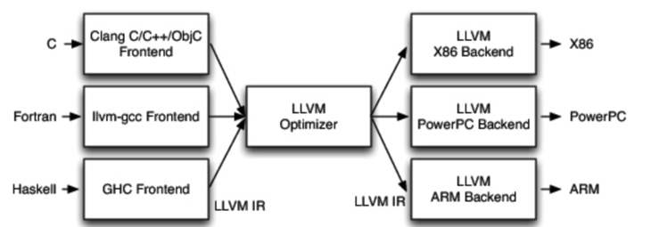
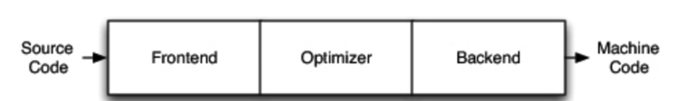
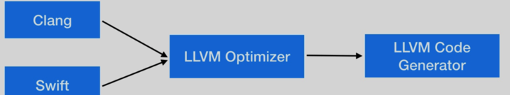
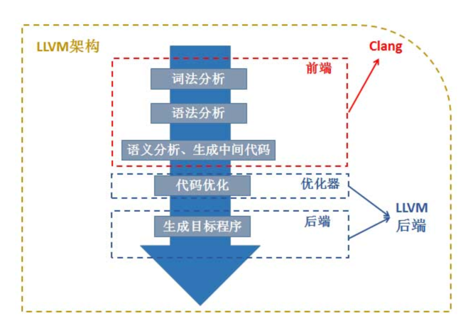

# LLVM（Low Level Virtual Machine虚拟机）



LLVM 是构架编译器（compiler 的框架系统，以 C++ 编写而成，用于优化以任意程序语言编写的程序的编译时间（compile-time）、链接时间（link-time）、运行时间
run-time）以及空闲时间（idle-time）， 对开发者保持开放，并兼容已有脚本。

LLVM 的命名最早源自于底层虚拟机（Low Level Virtual Machine） 的首字母缩写，但这个项目的范围并不局限于创建一个虚拟机，这个缩写导致了大量的疑惑。
LLVM 成长之后已成为众多编译工具及低级工具技术的统称，使得这个名字变得更不贴切，所以开发者决定放弃这个缩写的涵义，
现在 LLVM 已独立成为一个品牌， 适用于 LLVM 下的所有项目，包括 LLVM 中间码、LLVM 除错工具、LLVM C++ 标准库等

当编译器决定支持多种源语言或多种硬件架构时，LLVM 最重要的地方就来了。其他的编译器如GCC，它方法非常成功，但由于它是作为整体应用程序设计的，因此它们的用途受到了很大的限制。
LLVM 设计的最重要方面是，使用通用的代码表示形式 (IR)，它是用来在编译器中表示代码的形式。所以 LLVM
可以为任何编程语言独立编写前端，并且可以为任意硬件架构独立编写后端

## 传统编译器的工作原理



三段式，可以分为编译器前 (Frontend)、优化器(Optimizer) 和后端(Backend)/代码生成器(CodeGenerator)

- 编译器前端的任务是解析源代码。它会进行:词法分析，语法分析，语义分析，检查源代码是否存在错误，然后构建抽象语法树(Abstract
  Syntax Tree, AST)LLVM 的前端还会生成中间代码(intermediate representation，IR)
- 优化器对这一中间代码进行优化，试图使代码更高效
- 后端则负责将优化器优化后的中间代码转换为目标机器的代码，这一过程后端会最大化的利用目标机器的特殊指令，以提高代码的性能。

基于这个认知，我们可以认为 LLVM 包括了两个概念：一个广义的 LLVM 和一个狭义的 LLVM 。广义的 LLVM 指的是一个完整的 LLVM
编译器框架系统，包括了前端、优化器、后端、众多的库函数以及很多的模块；而狭义的 LLVM 则是聚焦于编译器后端功能的一系列模块和库，包括代码优化、代码生成、JIT
等。

### 案例：iOS 的编译器架构



ObjectiveC/C/C++ 使用的编译器前端是 Clang，Swift 是Swift，后端都是 LLVM。

## Clang

Clang 是一个 C、C++、Objective-C 和 Objective-C++ 编程语言的编译器前端，采用底层虚拟机（LLVM）作为后端.lld 是 Clang / LLVM
的内置链接器，clang 必须调用链接器来产生可执行文件。

LLVM 比较有特色的一点是它能提供一种代码编写良好的中间表示 IR，这意味着它可以作为多种语言的后端，这样就能够提供语言无关的优化同时还能够方便的针对多种
CPU 的代码生成。

### LLVM 和 Clang 关系



Clang 大致可以对应到编译器的前端，主要处理一些和具体机器无关的针对语言的分析操作；
编译器的优化器和后端部分就是之前提到的 LLVM 后端，即狭义的 LLVM。

### 至于为什么有了 GCC 还要开发 Clang？

- 1 Clang 采用的是 BSD 协议的许可证，而 GCC 采用的是 GPL 协议，显然前者更为宽松；
- 2 Clang 是一个高度模块化开发的轻量级编译器，编译速度快、占用内存小、有着友好的出错提示

### 使用 Clang

版本

```shell
➜  17_file_info git:(main) ✗ clang --version
Apple clang version 13.1.6 (clang-1316.0.21.2.5)
Target: arm64-apple-darwin21.6.0
Thread model: posix
InstalledDir: /Library/Developer/CommandLineTools/usr/bin
```

## 参考资料

1. [LLVM 的介绍及编译流程分析](https://juejin.cn/post/7003244900401545247)