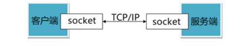

# Socket 

socket就是插座（中文翻译成套接字有点莫名其妙），运行在计算机中的两个程序通过socket建立起一个通道，数据在通道中传输。

socket把复杂的TCP/IP协议族隐藏了起来，对程序员来说，只要用好socket相关的函数，就可以完成网络通信。

## socket的分类
socket提供了流（stream）和数据报（datagram）两种通信机制，即流socket和数据报socket。

流socket基于TCP协议，是一个有序、可靠、双向字节流的通道，传输数据不会丢失、不会重复、顺序也不会错乱。就像两个人在打电话，接通后就在线了，您一句我一句的聊天。

数据报socket基于UDP协议，不需要建立和维持连接，可能会丢失或错乱。UDP不是一个可靠的协议，对数据的长度有限制，但是它的速度比较高。就像短信功能，一个人向另一个人发短信，对方不一定能收到。

在实际开发中，数据报socket的应用场景极少