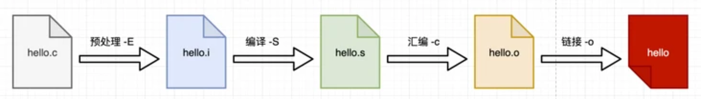
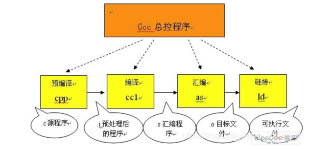
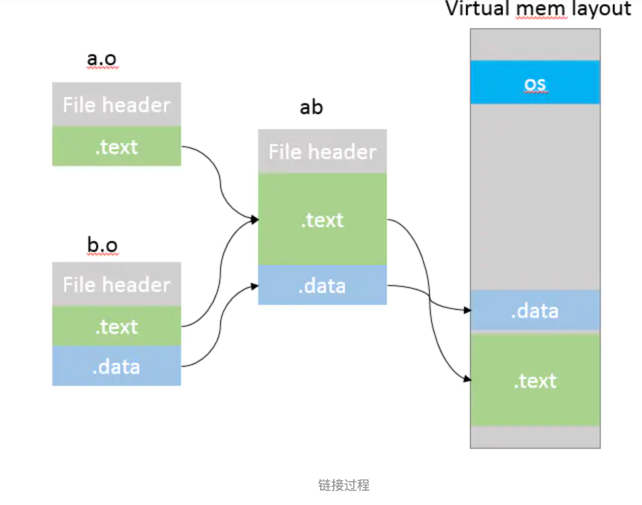

# 编译

## 编译过程


1. 第一个阶段是预处理阶段，由.c文件到.i文件，在正式的编译阶段之前进行。预处理阶段将根据已放置在文件中的预处理指令来修改源文件的内容。

    1. 将所有的#define删除，并且展开所有的宏定义。说白了就是字符替换
    2. 处理所有的条件编译指令，#ifdef #ifndef #endif等，就是带#的那些   
    3. 处理#include，将#include指向的文件插入到该行处
    4. 删除所有注释
    5. 添加行号和文件标示，这样的在调试和编译出错的时候才知道是是哪个文件的哪一行
    6. 保留#pragma编译器指令，因为编译器需要使用它们。

编译器生成汇编代码:
```shell script
gcc -E hello.c -o a.i

cat a.i
```

2. 第二个阶段编译:由.i文件到.s文件,主要完成的任务就是由编译器来检查一下你的程序是不是有问题是不是有一些语法错误，在vs下编写程序的时候也会编译一下看看我们的程序有没有error或者warning再去执行.
   当你的程序没有问题的时候编译还会把c程序编程汇编语言。
    1. 词法分析
    2. 语法分析
    3. 语义分析
    4. 优化后生成相应的汇编代码
```shell script
gcc -S a.i -o a.s

cat a.s
```   
   
3. 第三阶段是汇编阶段，由.s文件到.o文件,这一阶段就是把我们第二阶段生成的汇编代码变成我们的可执行文件，也就是把我们的汇编语言变成机器语言.
```shell script
gcc -c hello.c -o a.o
```

4. 第四个阶段是链接，链接过程实际上将多个目标文件.o的同类段进行合并处理合并成一个elf的执行文件,
例如，某个源文件中的函数可能引用了另一个源文件中定义的某个符号（如变量或者函数调用等）；
在程序中可能调用了某个库文件中的函数，等等。所有的这些问题，都需要经链接程序的处理方能得以解决。

```shell script
gcc a.o -o a

./a 

```

### 举例

mytest.c
```c
#include "mytest.h"
 
int main(int argc,char **argv) 
{ 
    test = 25; 
    printf("test.................%d/n",test); 
}
 
```

mytest.h文件
```c
// 头文件内容如下： 
int test;
```

1. 预处理阶段：编译器以C文件作为一 个单元，首先读这个C文件，发现第一句是包含一个头文件，就会在所有搜索路径中寻找这个文件，
   找到之后，就会将相应头文件中再去处理宏，变量， 函数声明，嵌套的头文件包含等，检测依赖关系，进行宏替换，看是否有重复定义与声明的情况发生，
   最后将h文件中所有的内容全部扫描进这个当前的C文件中，形成一个中间“C文件”
   
2. 编译阶段，在上一步中相当于将那个头文件中的test变量扫描进了一个中间C文件，那么test变量就变成了这个文件中的一个全局变量，
   此时就将所有这个中间C文件的所有变量，函数分配空间，将各个函数编译成二进制码，按照特定目标文件格式生成目标文件，
   在这种格式的目标文件中进行各个全局变量，函数的符号描述，将这些二进制码按照一定的标准组织成一个目标文件

3. 链接阶段，将上一步成生的各个目标文件，根据一些参数，连接生成最终的可执行文件，主要的工作就是重定位各个目标文件的函数，变量等，
   相当于将个目标文件中的二进制码按一定的规范合到一个文件中。
