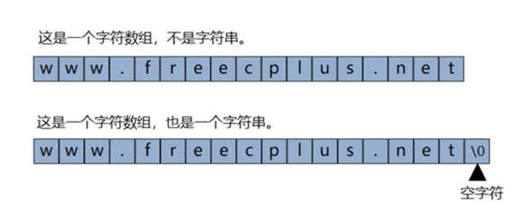

# Sting字符串


我们可以把字符串储存在char类型的数组中，如果char类型的数组末尾包含一个表示字符串末尾的空字符\0，则该数组中的内容就构成了一个字符串。

## 占用内存的情况
一个字符占用一字节的内存，字符串定义时数组的大小就是字符串占用内存的大小。
```c
char str[21];     // 占用21字节的内存
char str[1024];   // 占用1024字节的内存
```

## 字符串的初始化
1. 方式一
```c
char strname[21];
strname[0]=0;    // 把第一个元素的值置为0
```

2. 方式二
```c
char strname[21];
memset(strname,0,sizeof(strname));  // 把全部的元素置为0
```
strname[0]=0;不够规范，并且存有隐患，在实际开发中，一般采用memset的函数初始化字符串。

## 字符串与指针
在C语言中，数组名是数组元素的首地址，字符串是字符数组，所以在获取字符串的地址的时候，不需要用&取地址。
```c
char strname[21];
memset(strname,0,sizeof(strname));
strcpy(strname,"abcdefghijk");     // 把abcdefghijk赋值给strname
printf("%s\n",strname);              // 输出abcdefghijk
```

## 字符串越界
字符串是字符数组，字符串越界就是数组越界。字符串的越界是初学者经常犯的错误之一。
```c
#include <stdio.h>
#include <string.h>
 
int main()
{
  char strname1[21];
  memset(strname1,0,sizeof(strname1));
  char strname2[21];
  memset(strname2,0,sizeof(strname2));
  strcpy(strname1,"真的只能存十个汉字吗，多几个行不行？");
  strcpy(strname2,"是的，只能十个，多了不行。");
  printf("=%s=\n",strname1);
  printf("=%s=\n",strname2);
 
  char strname[2][21];
  memset(strname,0,sizeof(strname));
  strcpy(strname[1],"是的，只能十个，多了不行。");
  strcpy(strname[0],"真的只能存十个汉字吗，多几个行不行？");
  printf("=%s=\n",strname[0]);
  printf("=%s=\n",strname[1]);
}
```
前8行代码定义了两个字符串变量，每个能存放20个字符或10个中文，但实际赋值都超过了10个中文，从输出结果看，没有问题。

后6行代码采用了二维数组的方式定义了字符串变量，理论上说，与分开定义的两个字符串变量没有区别，但是，从输出结果看，很有问题。

真正的原因是这样的，在C语言中，数组越界肯定是非法的，但非法操作并不一定会出问题，前8行代码的字符串是越界了，但是strname1和strname2变量的内存之后的内存空间是未分配的，所以对strname1和strname2赋值过长也没关系。后6行代码就不一样了，二维数组的两个变量之间的内存是连续的，第一个元素之后没有多余的空间，所以第一个元素的值就出问题了。

总的来说，在C语言中，非法操作内存不一定会报错，要看运气。

在现实生活中，一个农民把庄稼种到了自家的地盘之外，如果您的地盘之外的地没有主人，是不会有问题的，但如果有主人，这事就肯定会引起纠纷，系统对这种纠纷的裁决是内存越界的程序非法，强制终止它（段错误）。

## 字符串常用的库函数
1. 获取字符串的长度（strlen）
```c
size_t  strlen( const char*  str);
```
功能：计算字符串的有效长度，不包含0。

返回值：返回字符串的字符数 。

strlen 函数计算的是字符串的实际长度，遇到第一个0结束。

函数返回值一定是size_t，是无符号的整数，即typedef unsigned int size_t。

如果您只定义字符串没有初始化，求它的长度是没意义的，它会从首地址一直找下去，遇到0停止。