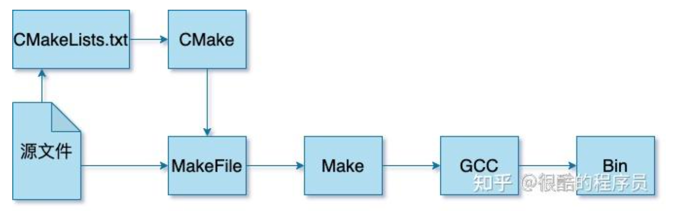

<!-- START doctoc generated TOC please keep comment here to allow auto update -->
<!-- DON'T EDIT THIS SECTION, INSTEAD RE-RUN doctoc TO UPDATE -->
**Table of Contents**  *generated with [DocToc](https://github.com/thlorenz/doctoc)*

- [CMake](#cmake)
  - [使用](#%E4%BD%BF%E7%94%A8)
    - [消息打印](#%E6%B6%88%E6%81%AF%E6%89%93%E5%8D%B0)
    - [编译静态库](#%E7%BC%96%E8%AF%91%E9%9D%99%E6%80%81%E5%BA%93)
    - [编译可执行文件](#%E7%BC%96%E8%AF%91%E5%8F%AF%E6%89%A7%E8%A1%8C%E6%96%87%E4%BB%B6)
  - [参考](#%E5%8F%82%E8%80%83)

<!-- END doctoc generated TOC please keep comment here to allow auto update -->


# CMake



CMake是一个跨平台的开源构建系统，它用于管理软件项目的构建过程。它可以生成适合各种操作系统和编译器的构建文件


## 使用

CMake提供cmake、ctest和cpack三个命令行工具分别负责构建、测试和打包.

```cmake
project(xxx) # 必须, 设置project名称
add_subdirectory(子文件夹名称) # 父目录必须，子目录没有下级子目录则不需要. 编译子文件夹的CMakeLists.txt
add_library(库文件名称 STATIC 文件) # 通常子目录（二选一）, 生成.a静态库
add_executable(可执行文件名称 文件)  # 通常父目录（二选一）,生成可执行文件
include_directories(路径) # 必须, 规定.h头文件路径
link_directories(路径) # 必须, 规定.so/.a库文件路径
target_link_libraries(库文件名称/可执行文件名称 链接的库文件名称) # 必须
```
使用cmake一般流程为：

* 编写CMakeLists.txt文件
* 生成构建系统（buildsystem，比如make工具对应的Makefile）；
* 执行构建（比如make），生成目标文件；
* 执行测试、安装或打包。


```shell
(⎈|kubeasz-test:volcano-system)➜  ~ cmake --help
Usage

  cmake [options] <path-to-source>
  cmake [options] <path-to-existing-build>
  cmake [options] -S <path-to-source> -B <path-to-build>

Specify a source directory to (re-)generate a build system for it in the
current working directory.  Specify an existing build directory to
re-generate its build system.

Options
  -S <path-to-source>          = 指定源文件根目录，必须包含一个CMakeLists.txt文件
  -B <path-to-build>           = 指定构建目录，构建生成的中间文件和目标文件的生成路径
  -C <initial-cache>           = Pre-load a script to populate the cache.
  -D <var>[:<type>]=<value>    = Create or update a cmake cache entry.
  // ...
```

```shell
cmake -S . -B build -DCMAKE_BUILD_TYPE=Debug -DAUTHOR=RealCoolEngineer
```


CMake语言在项目配置中组织为三种源文件类型：

* 目录：CMakeLists.txt，针对的是一个目录，描述如何针对目录（Source tree）生成构建系统，会用到项目配置命令；
* 脚本：<script>.cmake，就是一个CMake语言的脚本文件，可使用cmake -P直接执行，只能包含脚本命令；
* 模块：<module>.cmake，实现一些模块化的功能，可以被前面两者包含，比如include(CTest)启用测试功能。


### 消息打印
```cmake
message([<mode>] "message text" ...)
```

mode就相当于打印的等级，常用的有这几个选项：

* 空或者NOTICE：比较重要的信息，如前面演示中的格式
* DEBUG：调试信息，主要针对开发者
* STATUS：项目使用者可能比较关心的信息，比如提示当前使用的编译器
* WARNING：CMake警告，不会打断进程
* SEND_ERROR：CMake错误，会继续执行，但是会跳过生成构建系统
* FATAL_ERROR：CMake致命错误，会终止进程

### 编译静态库

将项目目录路径src/c/math下的源文件编译为静态库，那么需要获取编译此静态库需要的文件列表，可以使用set命令，或者file命令来进行设置
```cmake
file(GLOB_RECURSE MATH_LIB_SRC
        src/c/math/*.c
        )
add_library(math STATIC ${MATH_LIB_SRC})
```
使用file命令获取src/c/math目录下所有的*.c文件，然后通过add_library命令编译名为math的静态库，库的类型是第二个参数STATIC指定的。

如果指定为SHARED则编译的就是动态链接库。


### 编译可执行文件
通过add_executable命令来往构建系统中添加一个可执行构建目标，同样需要指定编译需要的源文件。
但是对于可执行文件来说，有时候还会依赖其他的库，则需要使用target_link_libraries命令来声明构建此可执行文件需要链接的库。

main.c就使用了src/c/math下实现的一些函数接口，所以依赖于前面构建的math库。
```cmake
add_executable(demo src/c/main.c)
target_link_libraries(demo math)
```


## 参考

- [新手入门学习cmake](https://zhuanlan.zhihu.com/p/690938516)
