# 树

## 基本术语

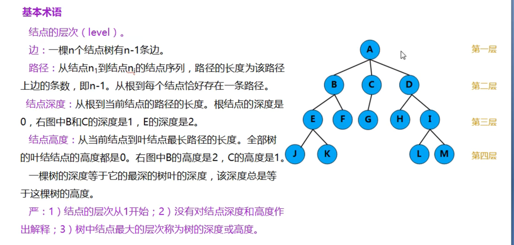

## 树的性质

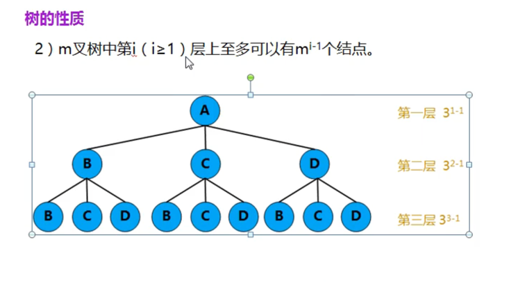
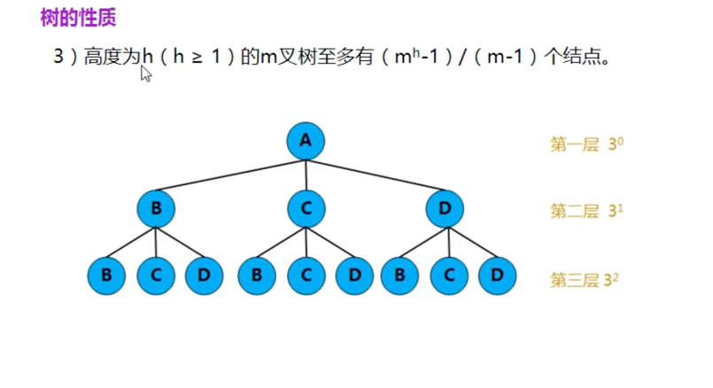

## binary_tree二叉树

### 性质
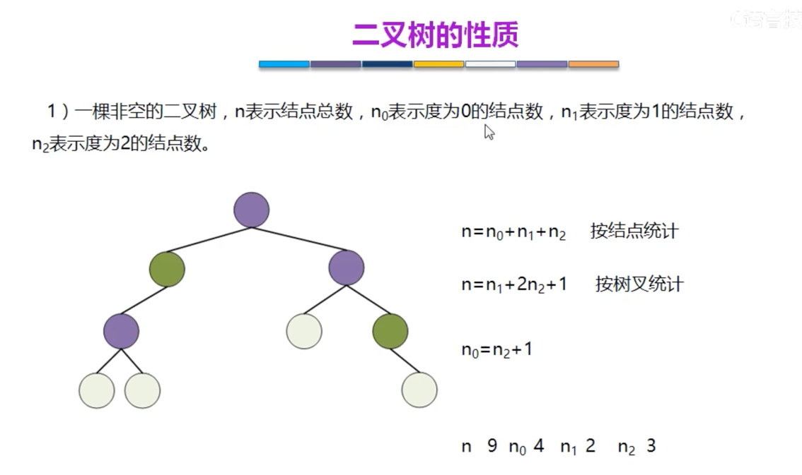
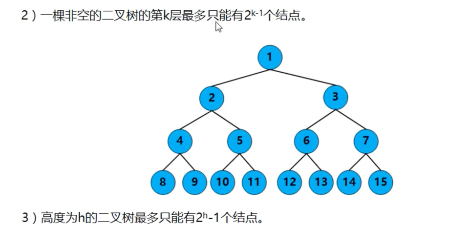

## 二叉树和度为2的树的区别
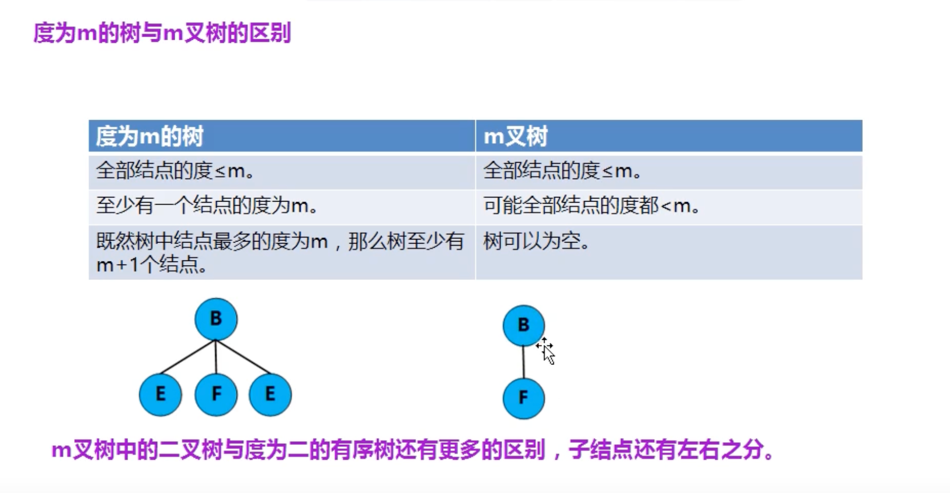

### 满二叉树
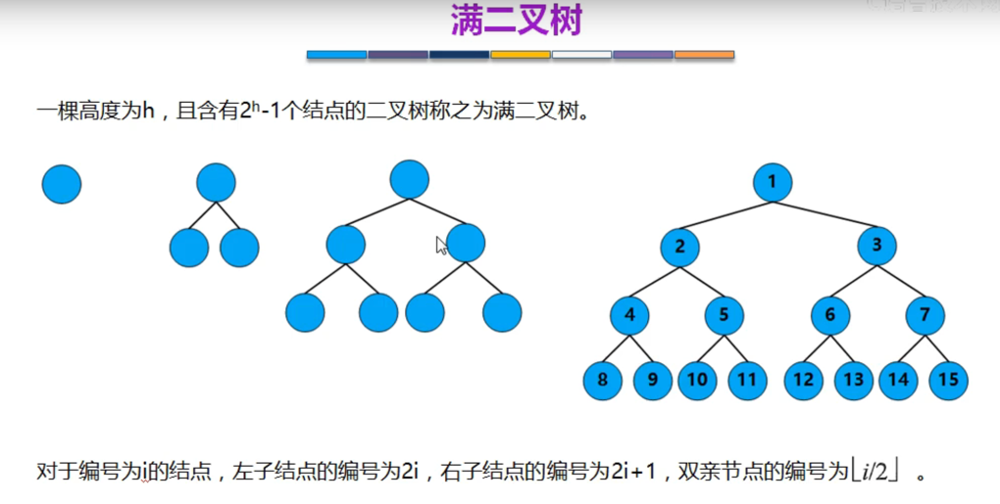

### 完全二叉树
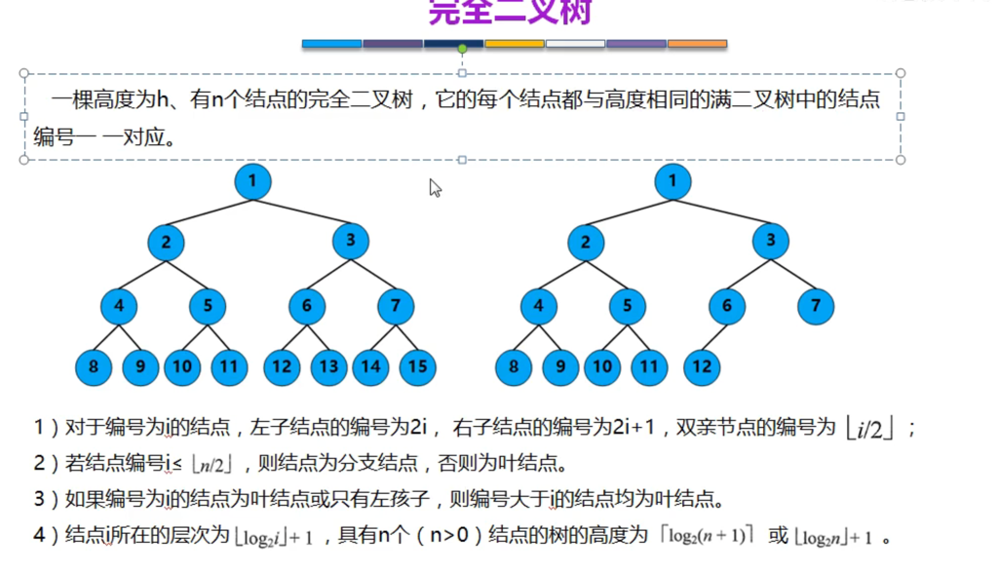

### 二叉排序树

## 二叉树的存储结构
### 完全二叉树的顺序存储

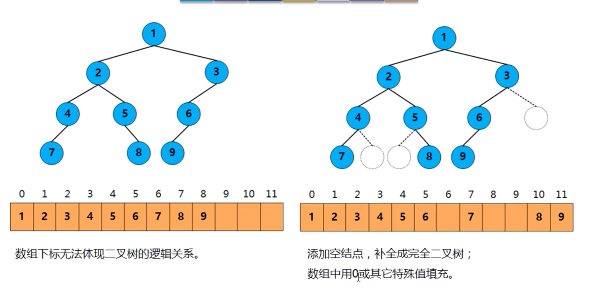
用顺序存储的方法普通二叉树容易造成空间的浪费

### 二叉树的链式存储
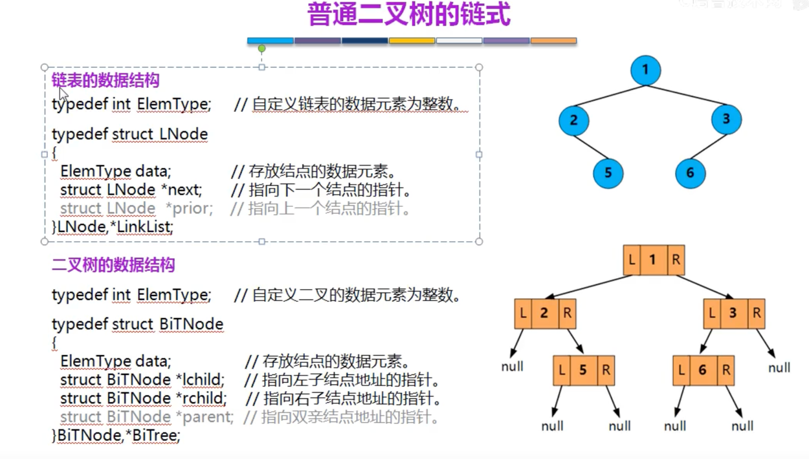

## 二叉树的遍历

### 层次遍历
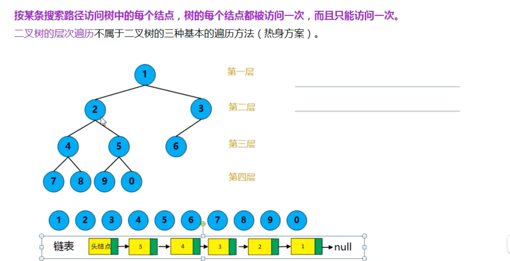

借助队列，出队时，帮左右子元素入队。

### 三种遍历方式

1. 先序遍历

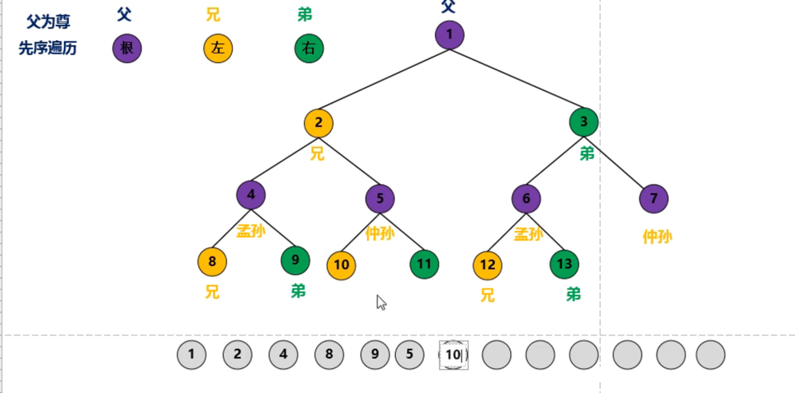

2. 中序遍历
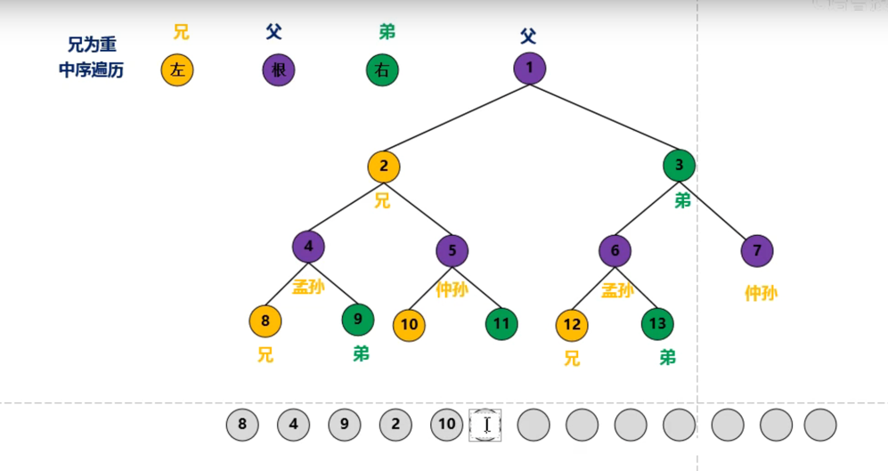

3. 后序遍历

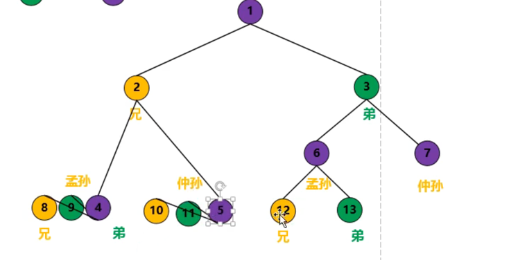

#### 遍历方式代码实现
递归方案实现先序遍历
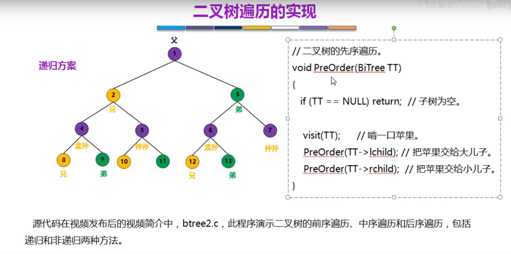

递归方案实现中序遍历
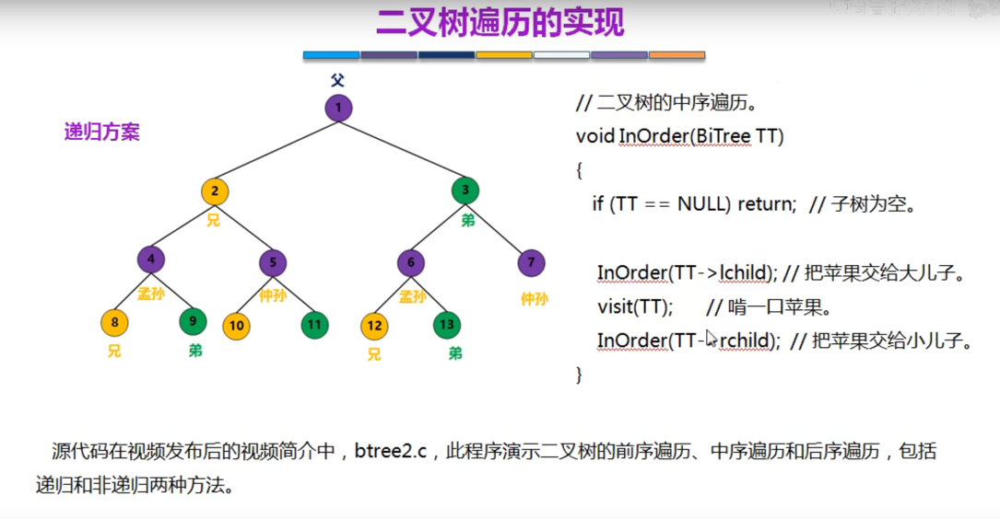

递归方案实现后序遍历

栈的方式实现中序遍历
