# 树

## 基本术语

## 树的性质

## binary_tree二叉树

### 性质

## 二叉树和度为2的树的区别

### 满二叉树

### 完全二叉树

### 二叉排序树

## 二叉树的存储结构
### 完全二叉树的顺序存储

用顺序存储的方法普通二叉树容易造成空间的浪费

### 二叉树的链式存储

## 二叉树的遍历

### 层次遍历

借助队列，出队时，帮左右子元素入队。

### 三种遍历方式

1. 先序遍历

2. 中序遍历

3. 后序遍历

#### 遍历方式代码实现
递归方案实现先序遍历

递归方案实现中序遍历

递归方案实现后序遍历

栈的方式实现中序遍历

## 二叉树的遍历
由遍历序列构造二叉树

先序+中序遍历 构造二叉树

层次+中序遍历 
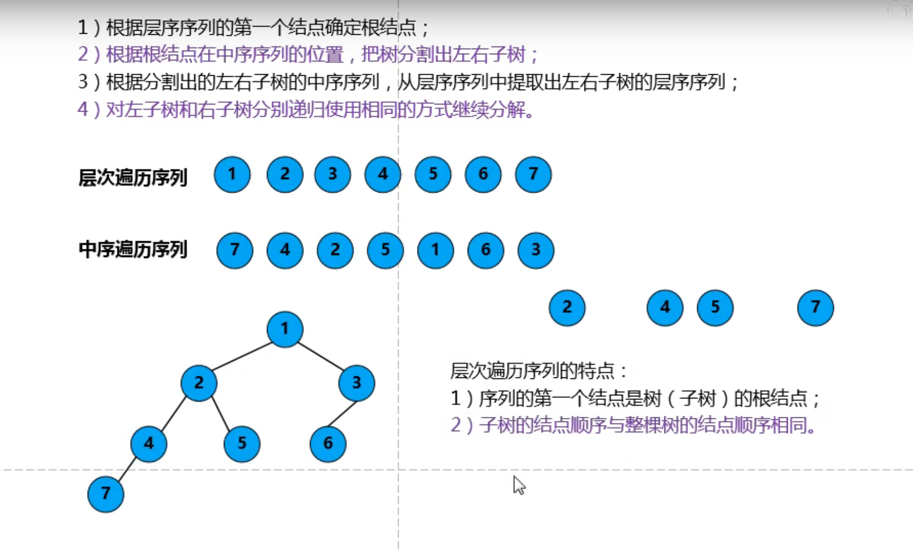

## 线索二叉树

线索二叉树，可以理解是用了二叉树中的空指针。

二叉树线索化

### 线索二叉树数据结构
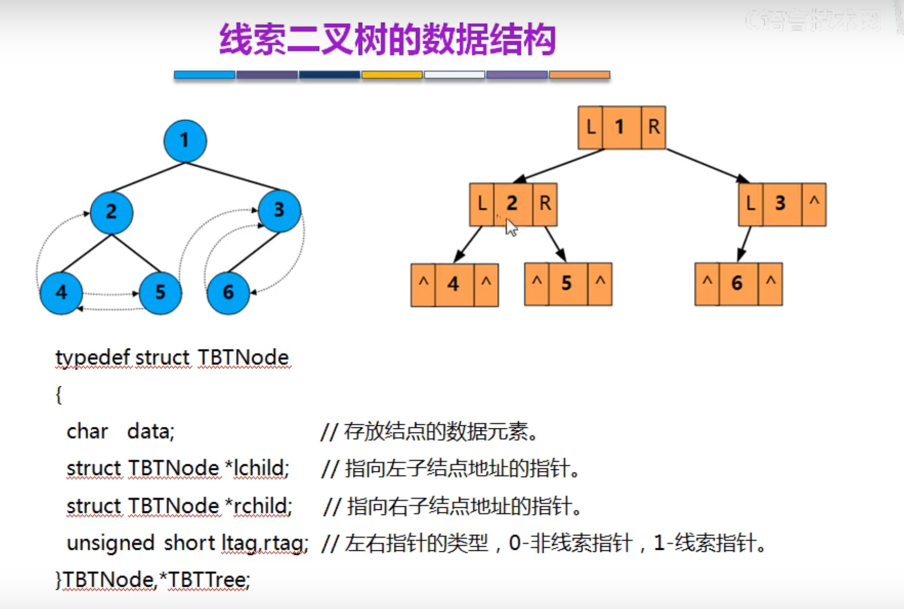

### 线索二叉树求前继和后继
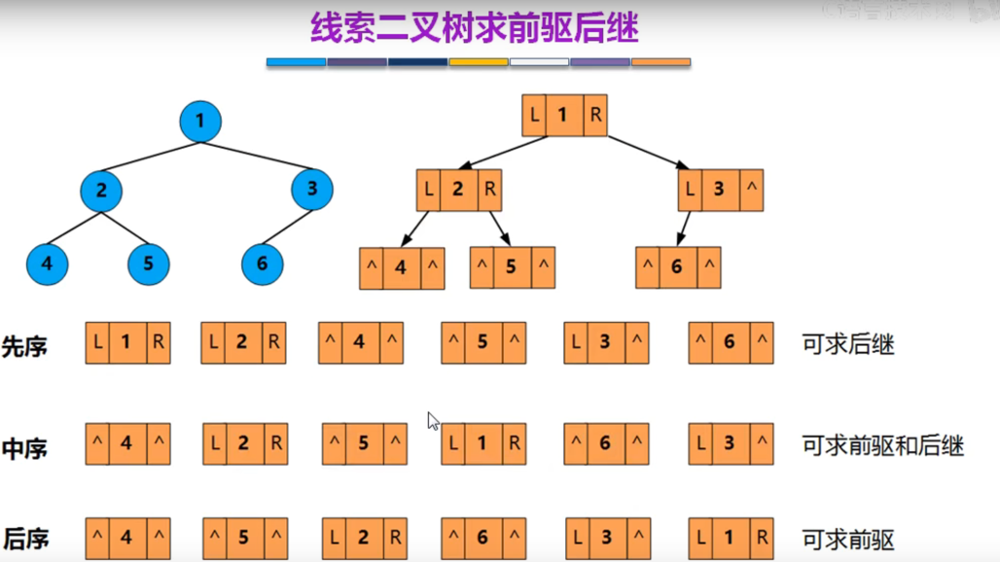

#### 先序线索二叉树求后继
 
 
#### 中序线索二叉树求前继和后继

### 二叉排序树的节点删除
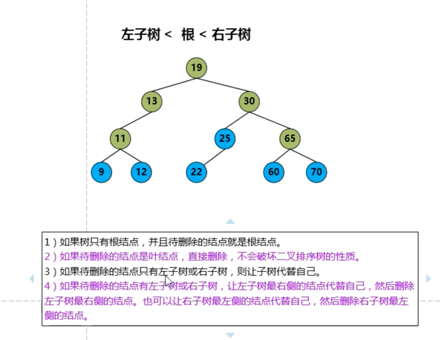 
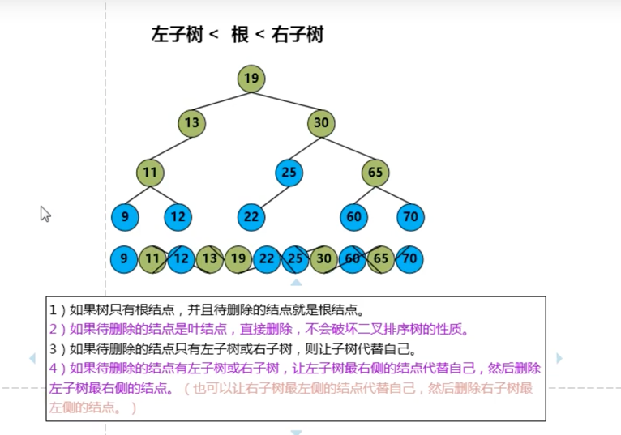

### 二叉排序树的查找效率分析

查找成功  的平均查找长度（ASL average search length）

 
查找失败   的平均查找长度（ASL average search length）

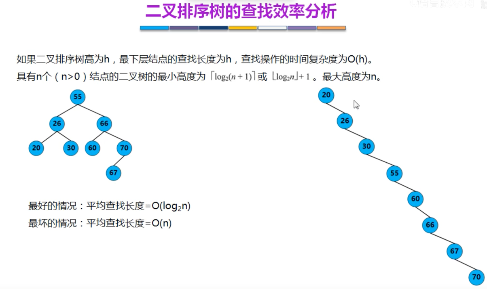

## 平衡二叉树 ---代码实现过于复杂
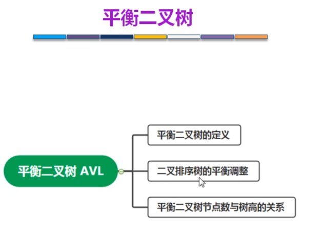
 

### 插入和删除 数据后不平衡

调整方式：调整最小不平衡子树，如70是最小的
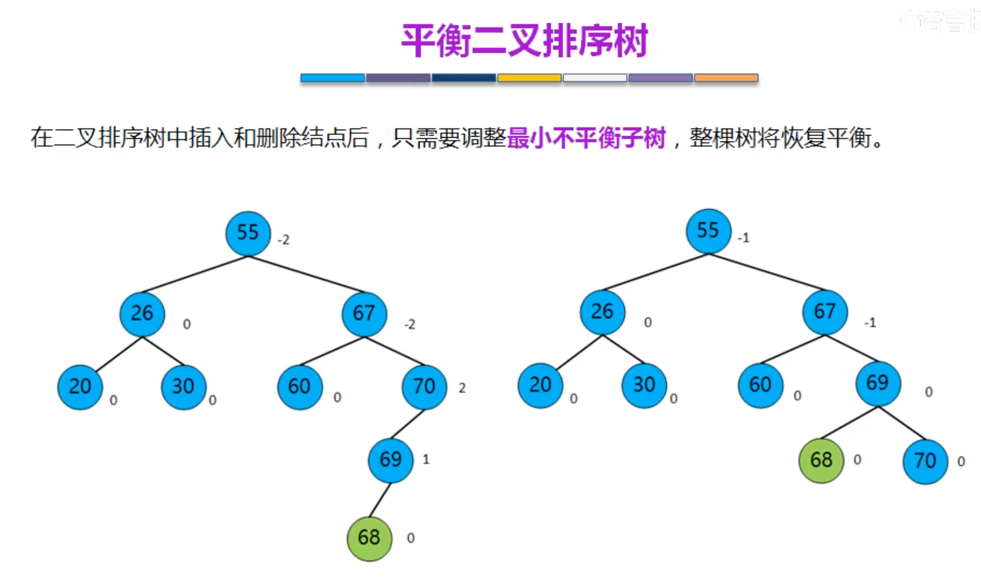 

从最小不平衡子树出发   
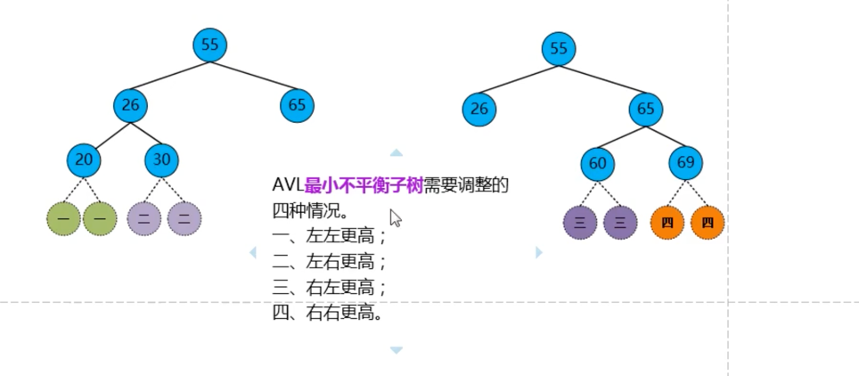
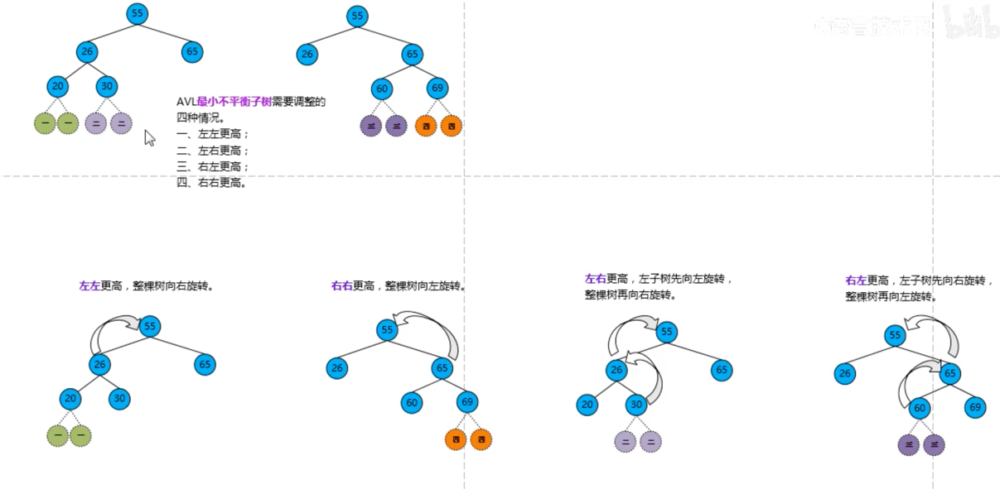
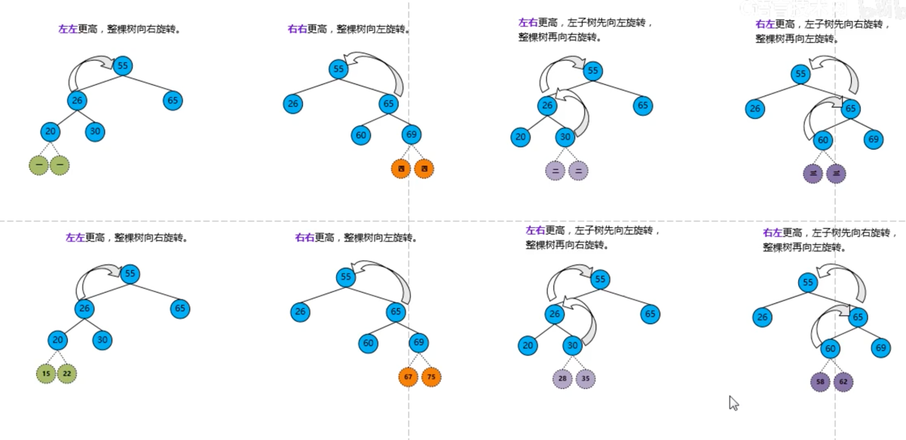

1. 左左更高

向右旋转，然后30放在右侧左子树

2. 左右更高
 
 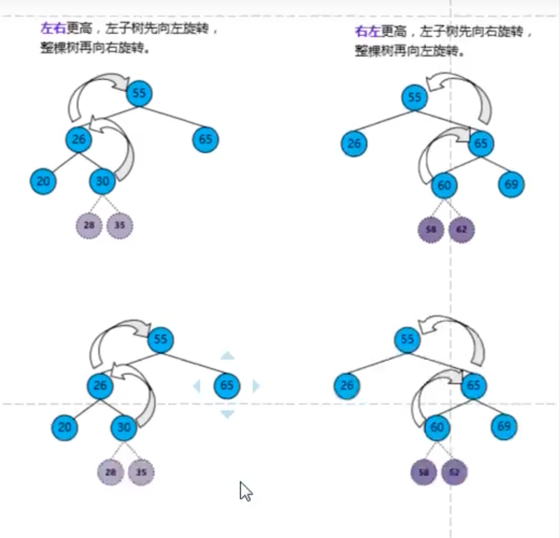
向左旋转,  向右旋转
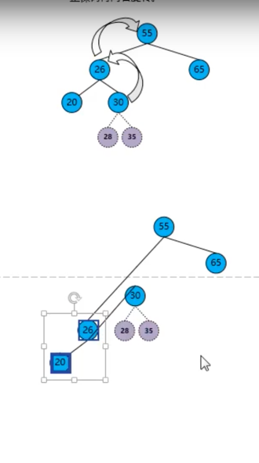 
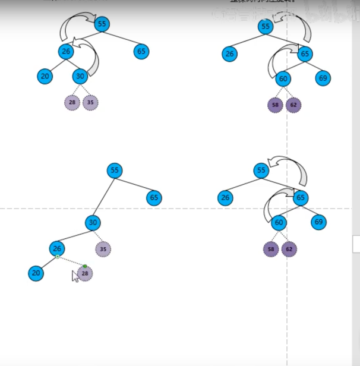

总结：  
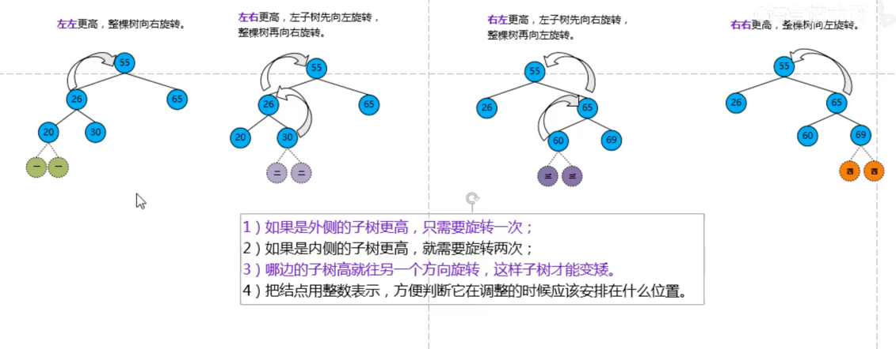

### 树高和节点关系
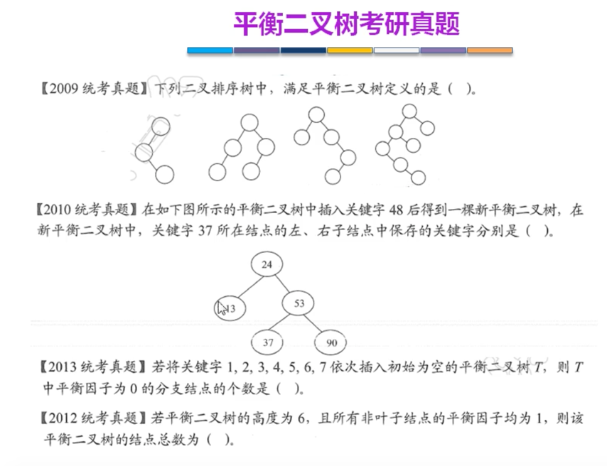

### 哈夫曼huffman树（最优二叉树）
在通信上广泛应用

把经常访问放在跟根结点最近的地方
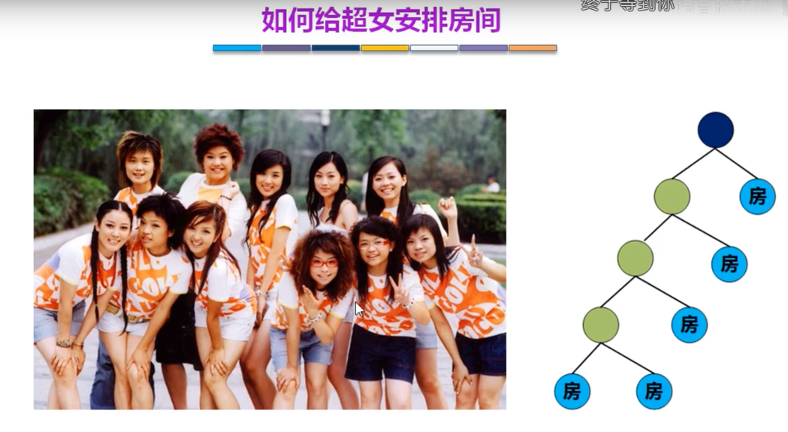
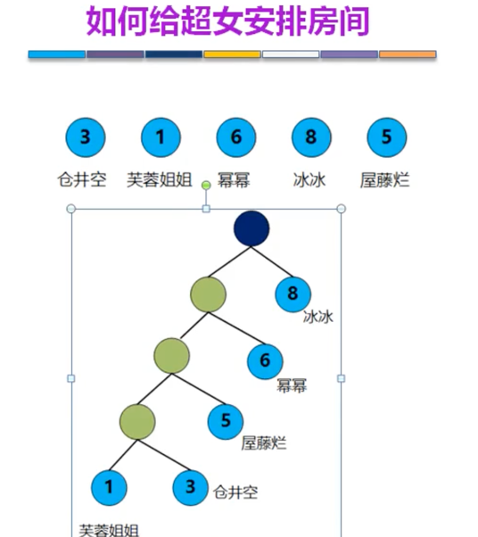

二进制表示:书写简单，不容易泄密
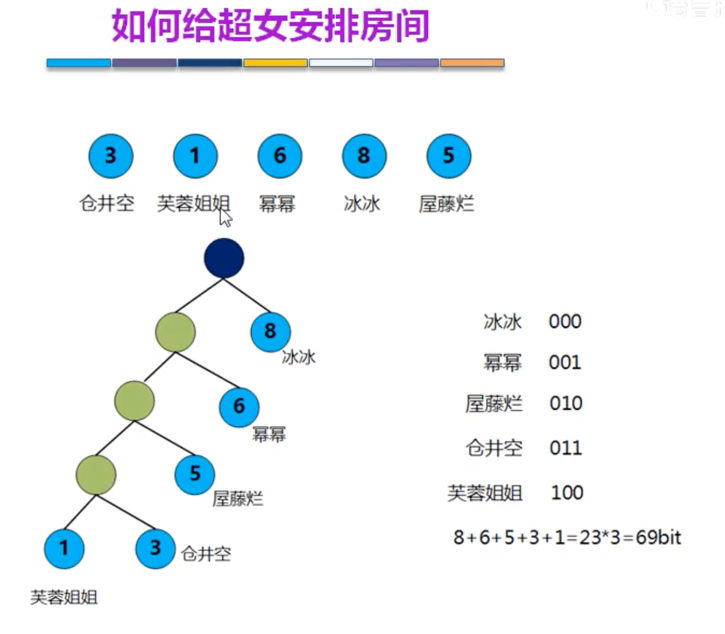
1. 浪费空间
2. 人物长度固定

1. 长度不固定
2. 长度短
