# 排序

## 堆排序

可以用数组下标表示
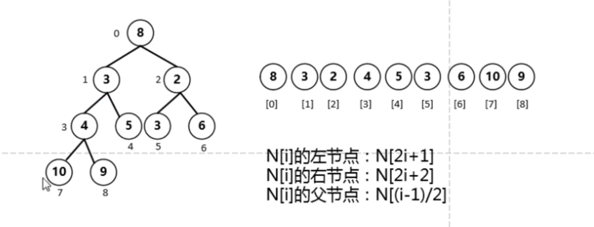

### 分类
大顶堆: 用于升序
小顶堆： 用于降序
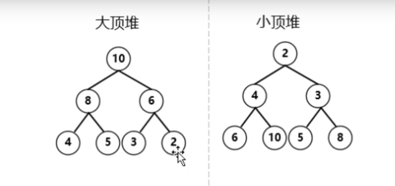

### 过程

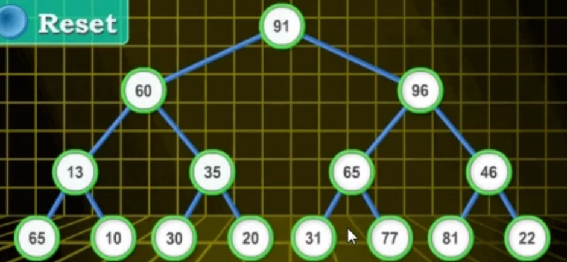
1. 从倒数第二层最后一个结点46开始
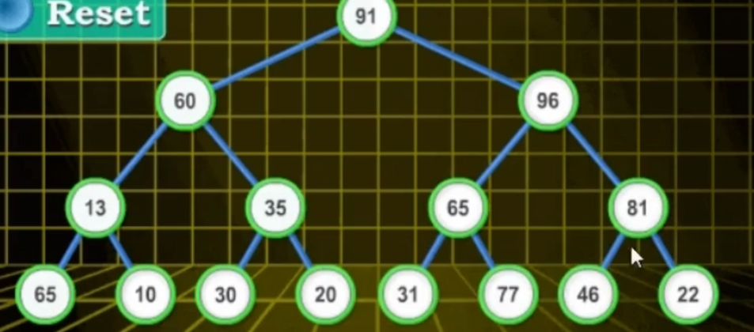
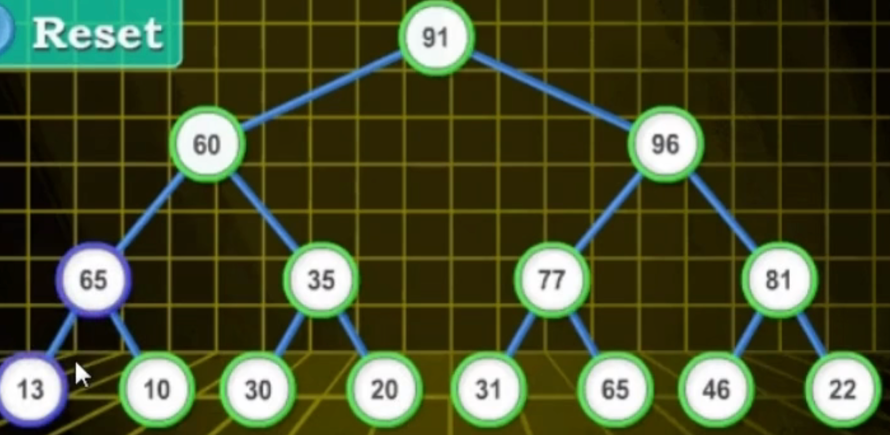

2. 从倒数第三层最后一个结点96开始
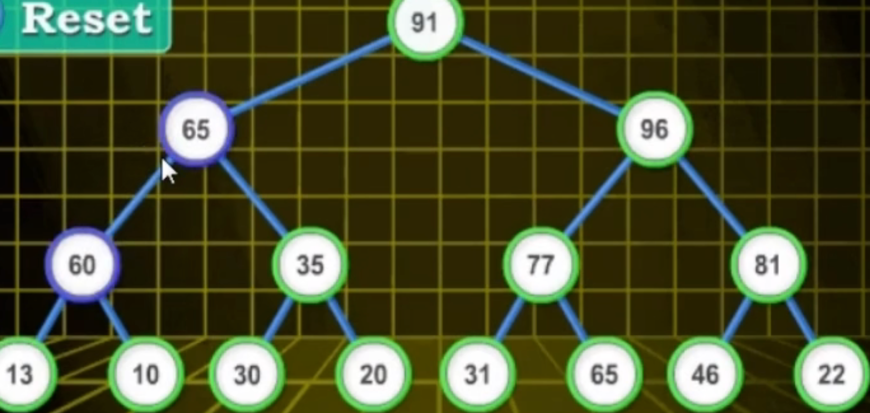

3. 轮到第一层
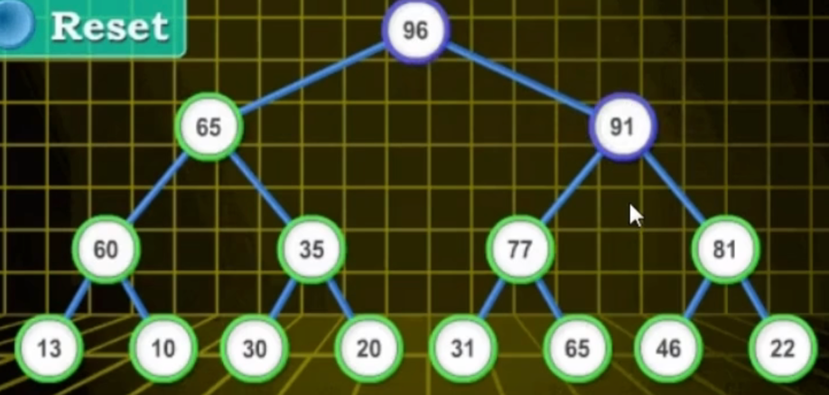

4. 第一个和最后一个，即96和22交换
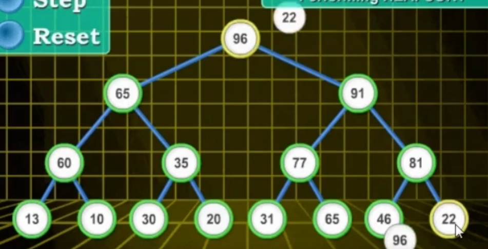

5. 拿走96，然后进行22元素的下沉(heapify--->理解为元素的下沉)
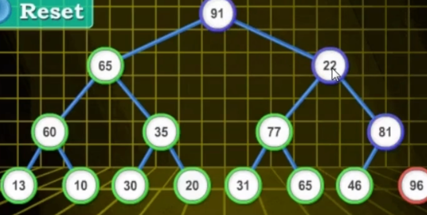
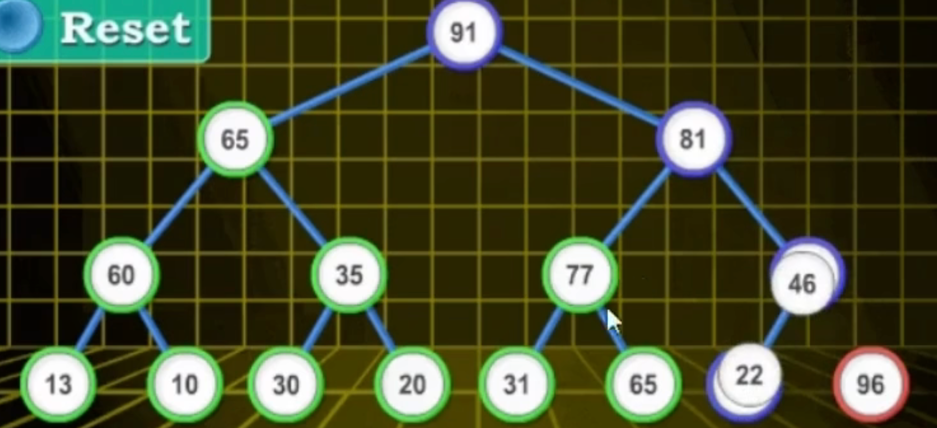

6. 91和22进行交换，重复5的操作进行下沉
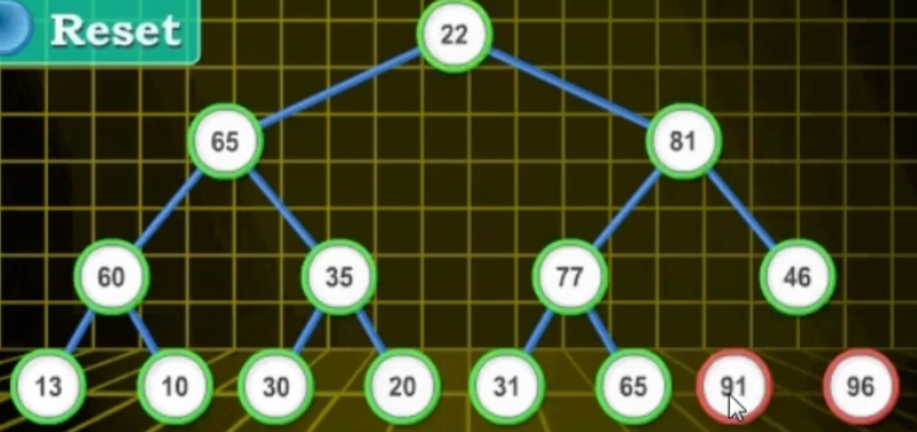
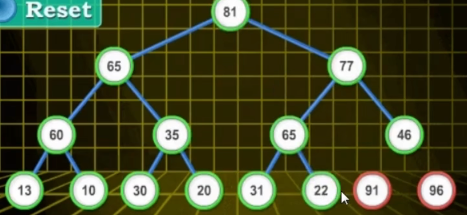

7. 最后结果
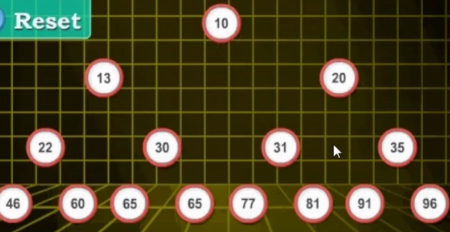
