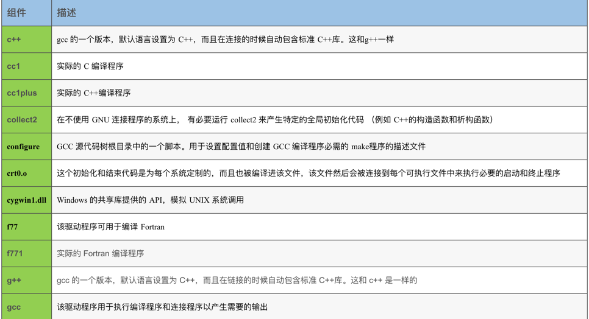
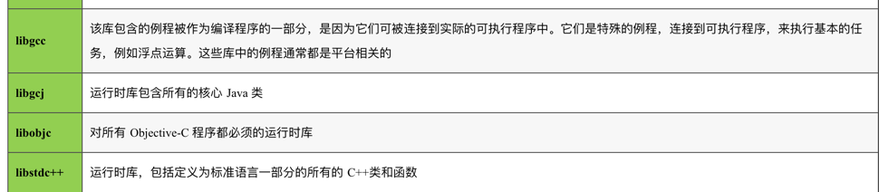
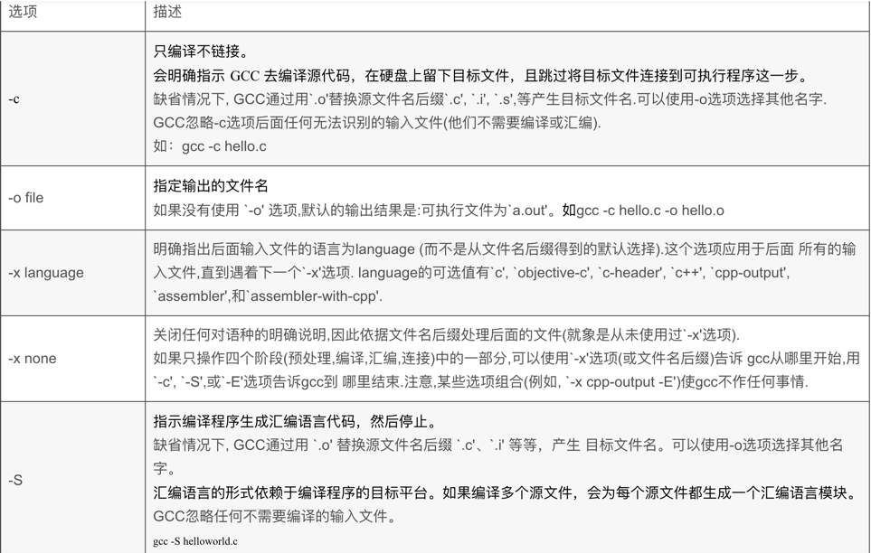
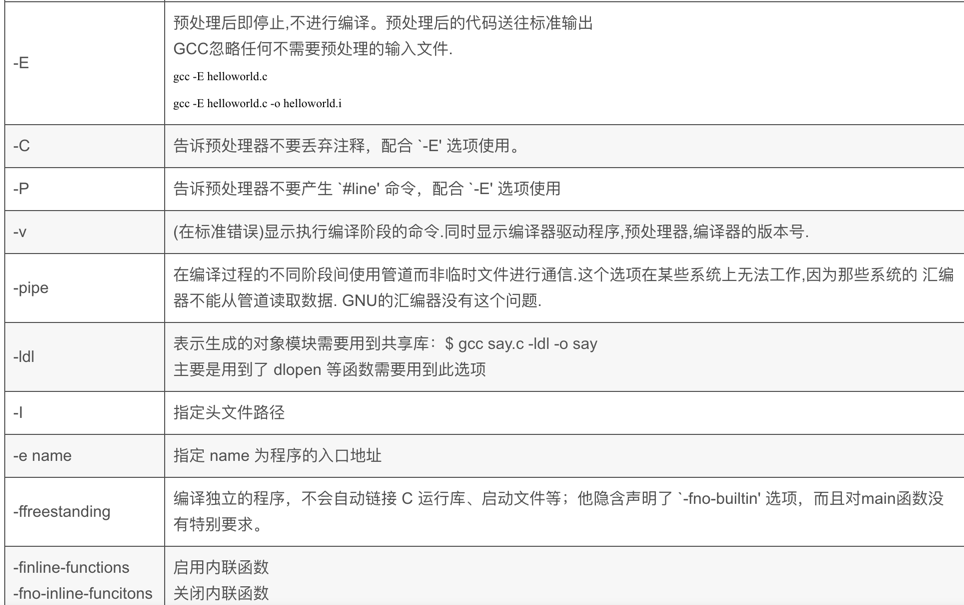
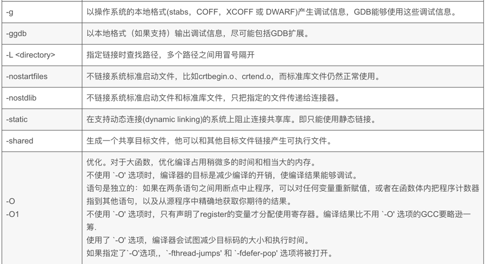
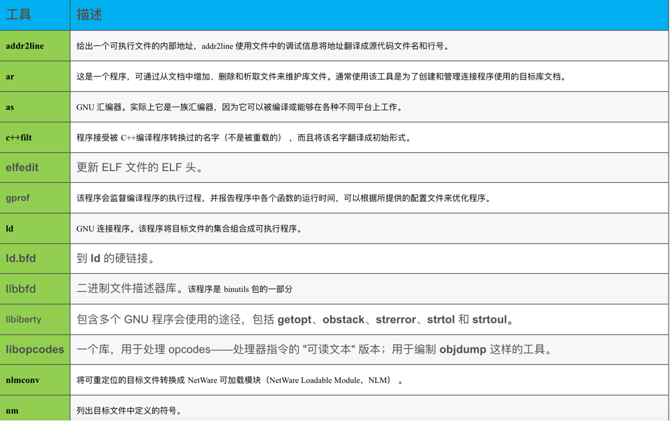
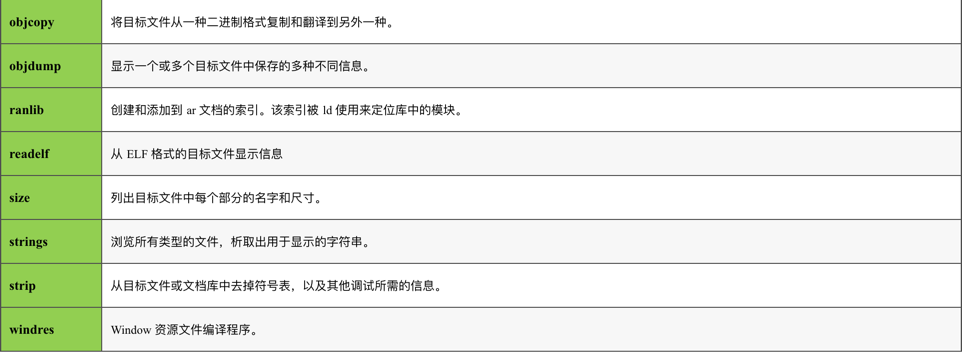

# GCC

## 版本

```shell
➜  17_file_info git:(main) ✗ gcc --version
Apple clang version 13.1.6 (clang-1316.0.21.2.5)
Target: arm64-apple-darwin21.6.0
Thread model: posix
InstalledDir: /Library/Developer/CommandLineTools/usr/bin

```

## 基本使用

在执行编译命令时，为了保证程序的健壮性，我们一般会同时附带参数 “-Wall”，让编译器明确指出程序代码中存在的所有语法使用不恰当的地方。

```shell

gcc demo.c -o demo -Wall && ./demo
```

## 组件及命令

组件：




命令：





工具集：




## ElF可执行链接格式 （ Executable and Linking Format

基本上任意一种可执行文件格式都是按区间保存上述信息，称为段（Segment）或节（Section）。

### LINUX平台下ELF文件加载过程的简单描述