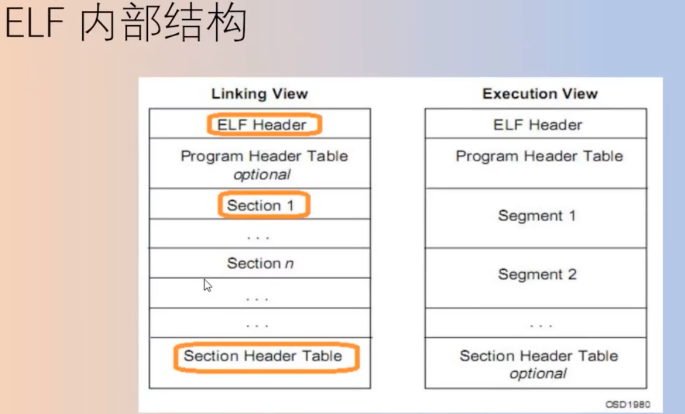
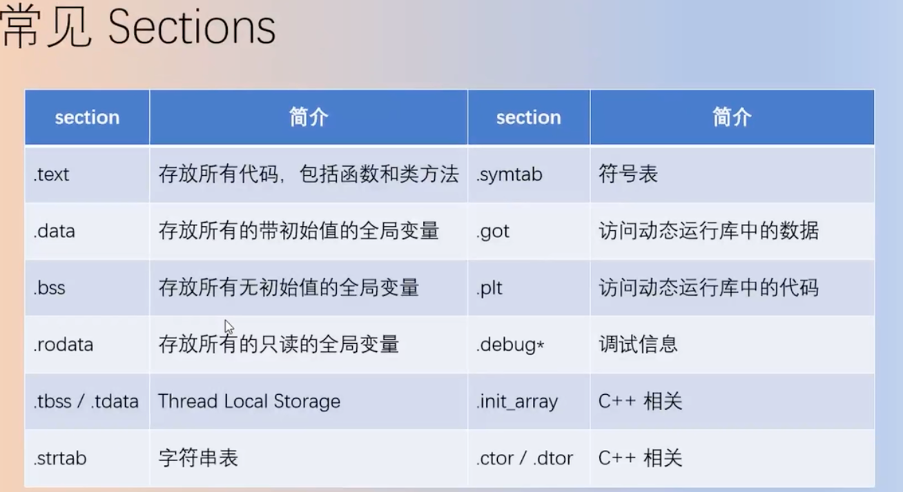

<!-- START doctoc generated TOC please keep comment here to allow auto update -->
<!-- DON'T EDIT THIS SECTION, INSTEAD RE-RUN doctoc TO UPDATE -->
**Table of Contents**  *generated with [DocToc](https://github.com/thlorenz/doctoc)*

- [GCC（GNU Compiler Collection，GNU 编译器套装）](#gccgnu-compiler-collectiongnu-%E7%BC%96%E8%AF%91%E5%99%A8%E5%A5%97%E8%A3%85)
  - [版本](#%E7%89%88%E6%9C%AC)
  - [基本使用](#%E5%9F%BA%E6%9C%AC%E4%BD%BF%E7%94%A8)
  - [组件及命令](#%E7%BB%84%E4%BB%B6%E5%8F%8A%E5%91%BD%E4%BB%A4)
  - [ElF可执行链接格式 （ Executable and Linking Format)](#elf%E5%8F%AF%E6%89%A7%E8%A1%8C%E9%93%BE%E6%8E%A5%E6%A0%BC%E5%BC%8F--executable-and-linking-format)

<!-- END doctoc generated TOC please keep comment here to allow auto update -->

# GCC（GNU Compiler Collection，GNU 编译器套装）

一套由 GNU 开发的编程语言编译器。
GCC 原名为 GNU C 语言编译器，因为它原本只能处理 C语言。GCC 快速演进，变得可处理 C++、Fortran、Pascal、Objective-C、Java 以及 Ada 等他语言。

## 版本

```shell
✗ gcc --version
Apple clang version 13.1.6 (clang-1316.0.21.2.5)
Target: arm64-apple-darwin21.6.0
Thread model: posix
InstalledDir: /Library/Developer/CommandLineTools/usr/bin

```

## 基本使用

在执行编译命令时，为了保证程序的健壮性，我们一般会同时附带参数 “-Wall”，让编译器明确指出程序代码中存在的所有语法使用不恰当的地方。

```shell

gcc demo.c -o demo -Wall && ./demo
```

## 组件及命令

组件：


命令：


工具集：


## ElF可执行链接格式 （ Executable and Linking Format) 


基本上任意一种可执行文件格式都是按区间保存上述信息，称为段（Segment）或节（Section）。

常见 sections



* .text: 编译好的程序指令；
* .rodata: 只读数据，如程序中的常量字符串；
* .data：已经初始化的全局变量；
* .bss：未经初始化的全局变量，在ELF文件中只是个占位符，不占用实际空间；
* .symtab：符号表，每个可重定位文件都有一个符号表，存放程序中定义的全局函数和全局变量的信息，注意它不包含局部变量信息，局部非静态变量由栈来管理，它们对链接器符号解析、重定位没有帮助。也要注意，.symtab和编译器中的调试符号无关；
* .debug_*: 调试信息，调试器读取该信息以支持符号级调试（如gcc -g生成）；
* .strtab：字符串表，包括.symtab和.[z]debug_*节符号的字符串值，以及section名；
* .rel.text：一个.text section中位置的列表，当链接器尝试把这个目标文件和其他文件链接时，需要修改这些位置的值，链接之前调用外部函数或者引用外部全局变量的是通过符号进行的，需要对这些符号进行解析、重定位成正确的访问地址。
* .rel.data：引用的一些全局变量的重定位信息，和.rel.text有些类似

